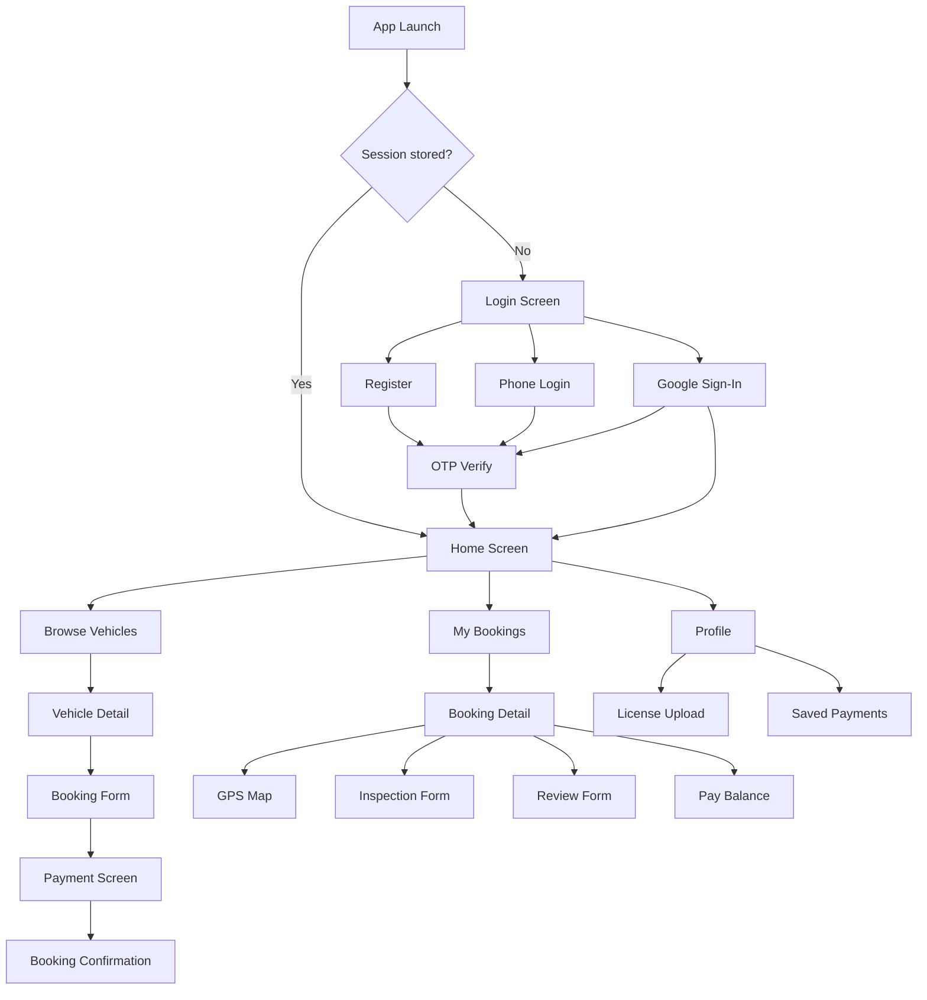

# Design Document: AutorideSystem Customer Mobile App

## Overview

The AutorideSystem Customer Mobile App is a cross-platform mobile application for iOS and Android built with Capacitor (HTML/CSS/JS), following the same architecture as the existing `admin_mobile` app. It gives Autoride customers a native-feeling experience to register, verify their identity, browse and book vehicles, pay, track their rented vehicle via GPS, complete inspection checklists, and manage their rental history.

The backend (Flask REST API on port 9999, backed by Supabase PostgreSQL) is fully implemented. This document describes the mobile client architecture, screen structure, component design, API integration patterns, and correctness properties.

### Key Design Goals

- Mirror the `admin_mobile` Capacitor project structure exactly so the team can apply the same build and deployment workflow.
- Keep the entire UI in a single `www/index.html` file with inline CSS and JS (same as `admin_mobile`), using a tab/page-switching pattern rather than a multi-page SPA framework.
- Use Capacitor plugins for camera, file picker, secure storage, and push notifications.
- Support configurable `API_BASE` so the app can point to any backend host (local dev, staging, production).
- Deliver a polished, customer-facing UI with the Autoride brand palette — distinct from the dark admin theme.

---

## Architecture

### Technology Stack

| Layer | Choice | Rationale |
|---|---|---|
| App shell | Capacitor 5.x | Same as `admin_mobile`; produces Android APK/AAB and iOS IPA from one codebase |
| UI | Vanilla HTML5 / CSS3 / ES6 JS | No build step; matches existing project convention |
| HTTP client | `fetch` API | Already used throughout `admin_mobile` |
| Secure storage | `@capacitor/preferences` | Replaces plain `localStorage` for session data |
| Camera / file | `@capacitor/camera` | Native camera and photo library access |
| Push notifications | `@capacitor/push-notifications` | In-app and OS-level notification support |
| Maps | Leaflet.js (CDN) | Lightweight, open-source; no API key required for tile rendering |
| PDF download | `GET /bookings/{id}/receipt` ? `Capacitor.Filesystem` | Backend generates PDF; app downloads and opens it |
| Icons | Font Awesome 6 (CDN) | Same as `admin_mobile` |
| Fonts | Google Fonts – Inter | Same as `admin_mobile` |

### Project Structure

```
customer_mobile/
??? capacitor.config.json          # App ID, webDir, server config
??? package.json                   # Capacitor + plugin dependencies
??? www/
?   ??? index.html                 # Entire app: HTML + inline CSS + inline JS
??? android/                       # Generated by `npx cap add android`
?   ??? app/src/main/
?       ??? AndroidManifest.xml    # Camera, internet, notification permissions
?       ??? assets/public/        # Capacitor copies www/ here on sync
??? ios/                           # Generated by `npx cap add ios`
    ??? App/App/                   # Capacitor iOS project
```

### Capacitor Configuration

```json
{
  "appId": "com.autoride.customer",
  "appName": "Autoride",
  "webDir": "www",
  "server": {
    "cleartext": true,
    "allowNavigation": ["autoride-booking-system.vercel.app"]
  }
}
```

### API Base Configuration

At the top of `www/index.html`, a single constant controls the backend URL:

```js
const API_BASE = 'http://192.168.1.x:9999'; // Change to match your server IP
```

This mirrors the pattern used in `admin_mobile/www/index.html`.

### Navigation Model

The app uses a **single-page, tab-switching** model. All screens are `<div>` elements with `display: none` by default. A central `showPage(id)` function hides all pages and shows the requested one. A bottom navigation bar (5 tabs) is visible after login.

```
Auth Flow (no bottom nav):
  splash ? login ? register ? otp-verify

Main App (bottom nav visible):
  home ? vehicles ? bookings ? profile ? more

Modal/Overlay Screens (pushed on top of current page):
  vehicle-detail, booking-form, payment, booking-detail,
  inspection, gps-map, review, split-payment, support, chatbot,
  notifications, saved-payments
```

### State Management

All runtime state lives in plain JS module-level variables. Session data (user_id, full_name, is_verified) is persisted via `@capacitor/preferences` (secure storage). No external state library is used.

```js
// Session (persisted)
let currentUser = { id: null, fullName: '', isVerified: 0 };

// Runtime state (in-memory)
let currentBookings = [];
let currentVehicles = [];
let activeBookingId = null;
let gpsRefreshInterval = null;
```

---

## Components and Interfaces

### Screen Inventory

#### Auth Screens

| Screen ID | Description | Key API Calls |
|---|---|---|
| `splash` | Autoride logo + loading spinner; checks stored session | `@capacitor/preferences` read |
| `login` | Email/password fields, Google Sign-In button, "Login with Phone" link | `POST /login`, `POST /auth/google` |
| `register` | Full name, Gmail, password fields | `POST /register` |
| `otp-verify` | 6-digit OTP input, resend link | `POST /auth/verify-email`, `POST /auth/verify-otp` |
| `phone-login` | Phone number input + OTP entry | `POST /auth/request-otp`, `POST /auth/verify-otp` |

#### Main Screens (Bottom Nav)

| Screen ID | Nav Icon | Description | Key API Calls |
|---|---|---|---|
| `home` | ?? Home | Welcome banner, quick-action cards, recent bookings strip, notification badge | `GET /user-bookings`, `GET /user/points` |
| `vehicles` | ?? Browse | Vehicle category grid with filter chips | `GET /vehicles/categories` |
| `bookings` | ?? Bookings | Booking history list with status pills | `GET /user-bookings` |
| `profile` | ?? Profile | User info, verification status, loyalty points, saved payments | `GET /profile`, `GET /user/points`, `GET /user/verify-status` |
| `more` | ? More | Support, newsletter, chatbot, notifications, logout | — |

#### Overlay/Modal Screens

| Screen ID | Trigger | Description |
|---|---|---|
| `vehicle-detail` | Tap vehicle card | Gallery carousel, specs, reviews, book button |
| `booking-form` | Tap "Book Now" | Date picker, location fields, addons, coupon, points |
| `payment` | After booking created | Amount summary, method selector, proof upload |
| `booking-detail` | Tap booking row | Full booking info, action buttons (cancel, pay balance, inspect, track, review) |
| `inspection-form` | Tap "Pre/Post Inspection" | Mileage, fuel, notes, photo capture |
| `gps-map` | Tap "Track Vehicle" | Leaflet map with vehicle marker, auto-refresh |
| `review-form` | Tap "Leave a Review" | Star selector, comment field |
| `split-payment` | Tap "Split Payment" | Partner email, amount input |
| `support-form` | Tap "Support" | Name, email, subject, message |
| `chatbot` | Tap "Chat" | Scrollable conversation view |
| `notifications-center` | Tap bell icon | List of past notifications |
| `saved-payments` | Tap "Saved Payments" | List + add new card form |
| `license-upload` | Tap "Upload License" | File picker + submit |
| `favorites` | Tap "Favorites" | Saved vehicle list |

### Component Patterns

#### API Helper

```js
async function apiCall(endpoint, options = {}) {
  const url = `${API_BASE}${endpoint}`;
  try {
    const res = await fetch(url, {
      headers: { 'Content-Type': 'application/json', ...options.headers },
      ...options
    });
    const data = await res.json();
    if (!res.ok) {
      if (res.status === 401 || res.status === 403) {
        // Unexpected auth failure — clear session and redirect
        if (!data.verification_required) {
          await clearSession();
          showPage('login');
        }
      }
      throw { status: res.status, message: data.error || data.message || 'Unknown error' };
    }
    return data;
  } catch (err) {
    if (err.status) throw err;
    throw { status: 0, message: 'Network error. Please check your connection.' };
  }
}
```

#### Toast Notification

```js
function showToast(message, type = 'info') {
  // type: 'success' | 'error' | 'info'
  // Creates a floating toast element, appends to body, auto-removes after 3s
}
```

#### Loading Overlay

```js
function showLoading(show) {
  document.getElementById('loadingOverlay').style.display = show ? 'flex' : 'none';
}
```

#### Secure Session

```js
const Session = {
  async save(user) { await Preferences.set({ key: 'user', value: JSON.stringify(user) }); },
  async load() { const { value } = await Preferences.get({ key: 'user' }); return value ? JSON.parse(value) : null; },
  async clear() { await Preferences.remove({ key: 'user' }); }
};
```

### Navigation Flow Diagram



---

## Data Models

These are the client-side JavaScript object shapes used throughout the app, derived from the backend API responses.

### User Session

```js
{
  id: Number,           // users.id
  fullName: String,     // users.full_name
  email: String,        // users.email
  isVerified: Number,   // 0 | 1 | 2
  loyaltyPoints: Number
}
```

### Vehicle Category (from `GET /vehicles/categories`)

```js
{
  brand: String,
  model: String,
  vehicle_type: String,       // 'Sedan' | 'SUV' | 'Van' | etc.
  transmission: String,       // 'Automatic' | 'Manual'
  fuel_type: String,          // 'Gasoline' | 'Diesel'
  seats: Number,
  daily_rate: Number,
  location: String,
  vehicle_image: String,      // primary image URL
  total_units: Number,
  available_units: Number,
  representative_id: Number   // vehicle.id used for booking
}
```

### Vehicle Detail (from `GET /vehicle/{id}`)

```js
{
  id: Number,
  brand: String,
  model: String,
  plate_number: String,
  vehicle_type: String,
  transmission: String,
  fuel_type: String,
  seats: Number,
  daily_rate: Number,
  location: String,
  status: String,
  latitude: Number | null,
  longitude: Number | null,
  last_gps_update: String | null,
  gallery: [String],          // array of image URLs
  avg_rating: Number,
  reviews: [Review],
  is_favorite: Boolean,
  pickup_instructions: [String]
}
```

### Booking (from `GET /user-bookings`)

```js
{
  id: Number,
  user_id: Number,
  vehicle_id: Number,
  brand: String,
  model: String,
  plate_number: String,
  start_date: String,         // 'YYYY-MM-DD'
  end_date: String,
  pickup_province: String,
  pickup_municipality: String,
  pickup_barangay: String,
  return_province: String,
  return_municipality: String,
  return_barangay: String,
  rental_type: String,        // 'Self-Drive' | 'With Driver'
  addons: String,             // comma-separated
  insurance_type: String,
  insurance_price: Number,
  base_price: Number,
  addon_price: Number,
  total_price: Number,
  payment_type: String,       // 'Full' | 'Downpayment'
  amount_paid: Number,
  balance_amount: Number,
  status: String,             // 'Pending' | 'Confirmed' | 'Approved' | 'Picked Up' | 'Completed' | 'Cancelled'
  payment_status: String,     // 'Unpaid' | 'Partially Paid' | 'Paid' | 'Refund Pending' | 'Refunded'
  cancellation_reason: String | null,
  applied_coupon_id: Number | null,
  discount_amount: Number,
  points_redeemed: Number,
  points_earned: Number
}
```

### Review

```js
{
  id: Number,
  user_id: Number,
  vehicle_id: Number,
  full_name: String,
  profile_picture: String | null,
  rating: Number,             // 1–5
  comment: String | null,
  created_at: String
}
```

### Inspection Record (from `GET /inspections/{booking_id}`)

```js
{
  id: Number,
  booking_id: Number,
  inspection_type: String,    // 'pickup' | 'return'
  mileage: Number,
  fuel_level: String,
  notes: String | null,
  photos: [String],           // array of image URLs (JSONB)
  inspector_id: Number,
  created_at: String
}
```

### Split Bill (from `GET /split-bills`)

```js
{
  id: Number,
  booking_id: Number,
  partner_email: String,
  amount: Number,
  status: String,             // 'Pending' | 'Paid'
  initiator_name: String,
  vehicle_brand: String,
  vehicle_model: String,
  start_date: String,
  end_date: String
}
```

### Saved Payment Method (from `GET /saved-payments`)

```js
{
  id: Number,
  user_id: Number,
  card_type: String,          // 'Visa' | 'Mastercard' | 'GCash' | etc.
  last_four: String,          // exactly 4 digits
  provider: String
}
```

---

## New Backend Endpoints Needed

The following endpoints are referenced in the requirements but need to be verified or added to the backend:

| Endpoint | Status | Notes |
|---|---|---|
| `GET /vehicles/categories` | ? Exists | Returns grouped vehicle data |
| `GET /vehicle/{id}` | ? Exists | Returns full detail with gallery, reviews, GPS |
| `GET /vehicles/{id}/location` (customer-facing) | ?? Needs addition | Current `GET /admin/gps-locations` is admin-only. A new `GET /vehicles/{id}/location` endpoint should return `latitude`, `longitude`, `last_gps_update` for a specific vehicle, scoped to the booking owner. |
| `POST /modify-booking` | ?? Needs addition | Requirements reference this endpoint but it is not in the current backend. Should accept `booking_id`, `user_id`, `start_date`, `end_date` and return `new_total`. |
| `POST /chat` | ? Exists | Smart FAQ chatbot endpoint |
| `GET /bookings/{id}/receipt` | ? Exists | PDF receipt download |
| `POST /validate-coupon` | ? Exists as `/coupons/verify` | App should use `/coupons/verify` |

---

## UI/UX Guidelines and Color Palette

The customer app uses a **light-mode-first** design to differentiate it from the dark admin app, while sharing the Autoride brand identity.

### Color Palette

```css
:root {
  /* Brand */
  --primary: #e63946;          /* Autoride red — CTAs, active states */
  --primary-dark: #c1121f;     /* Hover/pressed state */
  --primary-light: #ff6b6b;    /* Accents, icons */

  /* Backgrounds */
  --bg-page: #f8f9fa;          /* Page background */
  --bg-card: #ffffff;          /* Card surfaces */
  --bg-input: #f1f3f5;         /* Input fields */

  /* Text */
  --text-primary: #212529;     /* Headings, body */
  --text-secondary: #6c757d;   /* Labels, captions */
  --text-muted: #adb5bd;       /* Placeholders */

  /* Status */
  --success: #2dc653;
  --warning: #f4a261;
  --danger: #e63946;
  --info: #4361ee;

  /* Borders */
  --border: #dee2e6;
  --radius-sm: 8px;
  --radius-md: 16px;
  --radius-lg: 24px;

  /* Shadows */
  --shadow-card: 0 2px 12px rgba(0,0,0,0.08);
  --shadow-modal: 0 8px 32px rgba(0,0,0,0.16);
}
```

### Typography

- Font: **Inter** (same as admin app) — loaded from Google Fonts CDN
- Headings: 700–800 weight, letter-spacing -0.5px
- Body: 400–500 weight, 1.5 line-height
- Monetary values: always formatted as `PHP X,XXX.XX`

### Layout Principles

- Bottom navigation bar: 5 tabs, 75px height, safe-area-inset-bottom padding for iOS notch
- Cards: white background, 16px border-radius, subtle shadow
- Buttons: 48px minimum touch target, 16px border-radius, full-width for primary actions
- Forms: 16px padding inputs, clear error states with red border + error message below field
- Images: `object-fit: cover` in fixed-ratio containers (16:9 for vehicle gallery, 1:1 for profile)

---

## API Integration Patterns

### Authentication Headers

The backend currently uses `user_id` as a query parameter or body field (no JWT). The app passes `user_id` from the stored session on every authenticated request.

### File Upload Pattern

All file uploads use `FormData` (multipart/form-data). The Capacitor Camera plugin returns a base64 string or file URI; the app converts it to a `Blob` before appending to `FormData`.

```js
async function uploadFile(endpoint, formData) {
  const res = await fetch(`${API_BASE}${endpoint}`, {
    method: 'POST',
    body: formData  // No Content-Type header — browser sets multipart boundary
  });
  return res.json();
}
```

### GPS Polling

The GPS map screen uses `setInterval` to refresh vehicle location every 30 seconds. The interval is stored in `gpsRefreshInterval` and cleared when the map screen is closed.

```js
function startGpsPolling(vehicleId) {
  gpsRefreshInterval = setInterval(() => fetchVehicleLocation(vehicleId), 30000);
}
function stopGpsPolling() {
  clearInterval(gpsRefreshInterval);
  gpsRefreshInterval = null;
}
```

### Price Calculation (Client-Side)

The booking form calculates prices locally before submission to give real-time feedback:

```js
function calculateBookingPrice(dailyRate, startDate, endDate, addons, insurancePrice, couponPercent, pointsRedeemed, longTermDiscountDays, longTermDiscountPercent) {
  const days = dateDiffDays(startDate, endDate);
  const basePrice = dailyRate * days;
  const addonPrice = addons.reduce((sum, a) => sum + a.price, 0);
  const longTermDiscount = days >= longTermDiscountDays ? basePrice * (longTermDiscountPercent / 100) : 0;
  const subtotal = basePrice + addonPrice + insurancePrice - longTermDiscount;
  const couponDiscount = subtotal * (couponPercent / 100);
  const pointsDiscount = pointsRedeemed / 10; // 10 points = PHP 1
  const total = Math.max(0, subtotal - couponDiscount - pointsDiscount);
  const pointsEarned = Math.floor(total / 100);
  return { days, basePrice, addonPrice, longTermDiscount, couponDiscount, pointsDiscount, total, pointsEarned };
}
```

### Offline / Error Handling

- All `apiCall` invocations are wrapped in try/catch.
- Network errors (fetch throws) show: "Network error. Please check your connection."
- Unexpected server errors (5xx) show: "Something went wrong. Please try again."
- Raw stack traces are never shown to the user.
- Forms retain their values on error so the user does not have to re-enter data.
- If a 401/403 is received outside of expected verification flows, the session is cleared and the user is redirected to login.

### Local Storage Strategy

| Data | Storage | Reason |
|---|---|---|
| `user_id`, `full_name`, `is_verified` | `@capacitor/preferences` (secure) | Session persistence across restarts |
| `API_BASE` override | `@capacitor/preferences` | Allow runtime reconfiguration |
| Notification history | `@capacitor/preferences` | Persist notification center list |
| Vehicle filter state | In-memory only | Ephemeral UI state |
| Booking form draft | In-memory only | Not persisted; cleared on navigation |

---

## Correctness Properties

*A property is a characteristic or behavior that should hold true across all valid executions of a system — essentially, a formal statement about what the system should do. Properties serve as the bridge between human-readable specifications and machine-verifiable correctness guarantees.*

### Property 1: Gmail-only registration enforcement

*For any* email string, the client-side validation function `isGmailAddress(email)` SHALL return `true` if and only if the email ends with `@gmail.com` (case-insensitive).

**Validates: Requirements 1.3**

---

### Property 2: Booking price calculation correctness

*For any* combination of daily rate, rental duration (in days), add-on prices, insurance price, long-term discount threshold and percentage, coupon discount percentage, and loyalty points redeemed — the `calculateBookingPrice` function SHALL produce a total price that equals `(basePrice + addonPrice + insurancePrice - longTermDiscount - couponDiscount - pointsDiscount)` clamped to a minimum of 0, and the `pointsEarned` value SHALL equal `floor(total / 100)`.

**Validates: Requirements 7.5, 18.2, 18.3, 18.6**

---

### Property 3: Date range validation

*For any* pair of date strings `(startDate, endDate)`, the date validation function SHALL return `valid = true` if and only if `startDate >= today` AND `endDate > startDate`.

**Validates: Requirements 7.3, 7.4**

---

### Property 4: Whitespace-only input rejection

*For any* string composed entirely of whitespace characters (spaces, tabs, newlines), the `isBlank(str)` validation helper SHALL return `true`, and any form field marked as required SHALL reject such a value before submission.

**Validates: Requirements 1.8, 1.9, 15.3**

---

### Property 5: Phone number format normalization

*For any* phone number string, the `normalizePhone(phone)` function SHALL produce an 11-digit string starting with `0` (e.g., `09XXXXXXXXX`). Specifically: strings starting with `+63` SHALL have `+63` replaced with `0`; strings not starting with `0` SHALL have `0` prepended; strings already in `09XXXXXXXXX` format SHALL be returned unchanged.

**Validates: Requirements 3.6**

---

### Property 6: Loyalty points earned calculation round-trip

*For any* total booking price `P ? 0`, the points earned SHALL equal `floor(P / 100)`, and the monetary value of `N` points SHALL equal `N / 10` PHP. Therefore, for any booking total `P`, the round-trip `pointsEarned(P) ? pointsValue(pointsEarned(P))` SHALL equal `floor(P / 100) / 10`.

**Validates: Requirements 18.6**

---

### Property 7: File validation — format and size

*For any* file selected by the user, the `validateUploadFile(file)` function SHALL return an error if `file.type` is not `image/jpeg` or `image/png`, and SHALL return an error if `file.size > 5 * 1024 * 1024` (5 MB). For all files passing both checks, the function SHALL return no error.

**Validates: Requirements 5.4, 5.5, 8.7**

---

### Property 8: Downpayment amount calculation

*For any* booking total price `T`, when `payment_type` is `Downpayment`, the amount due now SHALL equal `T * 0.20` and the balance amount SHALL equal `T * 0.80`, and `amountDueNow + balanceAmount === T`.

**Validates: Requirements 8.8**

---

### Property 9: Last-four digits validation

*For any* string `s`, the `isValidLastFour(s)` function SHALL return `true` if and only if `s` matches the regex `/^\d{4}$/` (exactly 4 decimal digits).

**Validates: Requirements 14.4**

---

### Property 10: Monetary display formatting

*For any* numeric value `v ? 0`, the `formatPHP(v)` function SHALL return a string of the form `"PHP X,XXX.XX"` with exactly two decimal places and comma-separated thousands.

**Validates: Requirements 20.7**

---

## Error Handling

### Client-Side Validation Errors

All form fields are validated before any API call. Errors are displayed inline below the relevant field using a `.field-error` span element. The submit button is re-enabled after an error so the user can correct and retry.

### API Error Mapping

| HTTP Status | Scenario | User-Facing Message |
|---|---|---|
| 400 | Validation error from backend | Display `error` field from response |
| 401 | Invalid credentials | "Invalid credentials." |
| 403 + `verification_required` | Email not verified | Redirect to OTP screen |
| 403 + `Account Frozen` | Account suspended | Display `reason` from response |
| 403 + license error | License not verified | "License verification required before booking." |
| 404 | Resource not found | Display `error` field from response |
| 409 | Email already registered | "Email already registered." |
| 500 | Server error | "Something went wrong. Please try again." |
| 0 (network) | No connectivity | "Network error. Please check your connection." |

### GPS Unavailability

When `latitude` or `longitude` is null on the vehicle record, the map screen displays: "Live tracking is currently unavailable for this vehicle." The "Track Vehicle" button is still shown but the map renders a placeholder message instead of a marker.

### File Upload Failures

If a Supabase Storage upload fails (backend returns error), the app displays the backend error message and retains the selected file so the user can retry without re-selecting.

---

## Testing Strategy

### Unit Tests (Vitest or Jest)

Unit tests cover pure JavaScript utility functions that have no DOM or Capacitor dependencies. These are the primary targets for property-based testing.

Key modules to unit test:
- `isGmailAddress(email)` — email domain validation
- `calculateBookingPrice(...)` — price calculation engine
- `validateDateRange(start, end)` — date validation
- `isBlank(str)` — whitespace detection
- `normalizePhone(phone)` — phone number normalization
- `validateUploadFile(file)` — file type and size validation
- `isValidLastFour(s)` — card digit validation
- `formatPHP(value)` — monetary formatting

### Property-Based Tests (fast-check)

The project uses [fast-check](https://github.com/dubzzz/fast-check) for property-based testing. Each property test runs a minimum of 100 iterations.

**Tag format:** `// Feature: autoride-customer-mobile-app, Property {N}: {property_text}`

Example test structure:

```js
import fc from 'fast-check';
import { isGmailAddress } from './validators';

// Feature: autoride-customer-mobile-app, Property 1: Gmail-only registration enforcement
test('isGmailAddress returns true iff email ends with @gmail.com', () => {
  fc.assert(fc.property(
    fc.emailAddress(),
    (email) => {
      const result = isGmailAddress(email);
      const expected = email.toLowerCase().endsWith('@gmail.com');
      return result === expected;
    }
  ), { numRuns: 100 });
});
```

Properties 1–10 each map to a single property-based test. Edge cases (empty strings, boundary values, special characters) are covered by fast-check's built-in generators.

### Integration Tests

Integration tests verify that the app correctly calls the backend and handles responses. These use `msw` (Mock Service Worker) or simple fetch mocks to simulate backend responses without a live server.

Key integration test scenarios:
- Successful login stores session data
- Failed login (401) shows error message
- Booking creation with valid data navigates to payment screen
- Payment submission with proof upload calls correct endpoint
- GPS polling starts on map open and stops on map close

### End-to-End Tests (Manual / Appium)

Full E2E flows are validated manually on physical devices during QA:
1. Register ? verify email ? login
2. Browse vehicles ? apply filters ? view detail
3. Create booking ? pay ? view confirmation
4. Cancel booking
5. Submit pre-rental inspection with photos
6. Track vehicle on GPS map
7. Leave a review after completion

### Accessibility

- All interactive elements have minimum 48×48px touch targets
- Color contrast ratios meet WCAG AA (4.5:1 for normal text, 3:1 for large text)
- Form inputs have associated `<label>` elements
- Error messages are associated with their fields via `aria-describedby`

Note: Full WCAG compliance requires manual testing with assistive technologies (VoiceOver on iOS, TalkBack on Android) and expert accessibility review.
