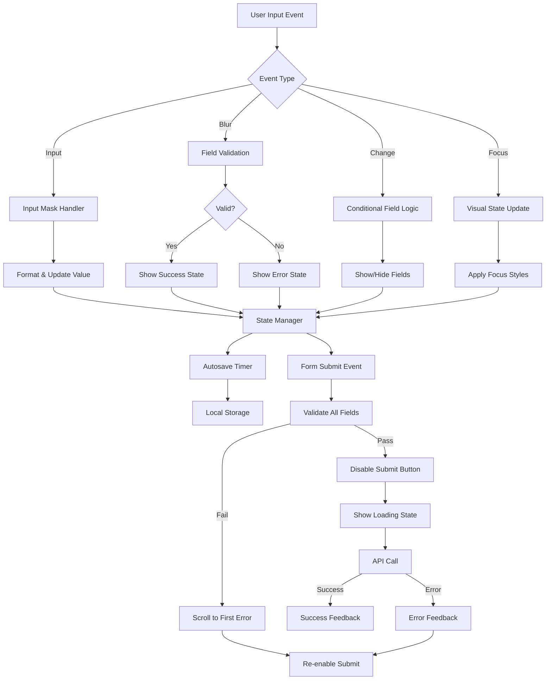
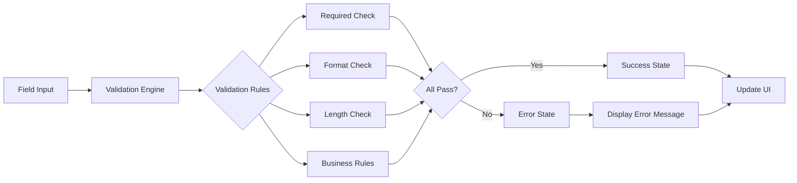

# Design Document: Customer Mobile Form Improvements

## Overview

This design document specifies the comprehensive technical implementation for enhancing all forms in the AutorideSystem Customer Mobile App. The improvements address 20 key requirements covering user experience, validation, accessibility, performance, and data quality across registration, booking, payment, profile, and other form-based interactions.

### Goals

- Provide clear field labels, instructions, and visual feedback for all form inputs
- Implement real-time validation with inline error messages
- Add input masks and automatic formatting for phone numbers, dates, and other structured data
- Display character counters for text fields with length limits
- Improve error messaging with specific, actionable guidance
- Enable autocomplete and smart suggestions for faster data entry
- Add progress indicators for multi-step forms (booking flow)
- Ensure accessible touch targets and keyboard optimization
- Implement form autosave and recovery for interrupted sessions
- Support conditional field display based on user selections
- Enhance date/time pickers with business rule enforcement
- Improve file upload experience with previews and validation
- Provide clear submission feedback and loading states
- Meet WCAG AA accessibility standards
- Implement smart field dependencies and auto-calculations
- Organize forms with visual grouping and responsive layouts
- Add inline help and tooltips for complex fields
- Optimize performance for instant responsiveness

### Non-Goals

- Backend API changes (all improvements are frontend-only)
- Changes to other mobile apps (admin or driver apps)
- Internationalization beyond Philippine English
- Offline form submission (requires network connectivity)
- Advanced password strength scoring algorithms
- Integration with third-party address validation services

### Technology Stack

- **Frontend Framework**: Vanilla JavaScript with Capacitor for native mobile features
- **UI**: HTML5, CSS3 with CSS custom properties for theming
- **State Management**: Custom lightweight state manager for form data
- **Storage**: Capacitor Preferences API for autosave functionality
- **Testing**: Vitest with jsdom for unit and integration tests
- **Property-Based Testing**: fast-check for validation logic testing

## Architecture

### High-Level Architecture

The form improvement system is built on a modular architecture with clear separation of concerns:

```
???????????????????????????????????????????????????????????????
?                     Presentation Layer                       ?
?  (HTML Forms, Input Components, Visual Feedback)            ?
???????????????????????????????????????????????????????????????
                     ?
???????????????????????????????????????????????????????????????
?                   Form Management Layer                      ?
?  ????????????????  ????????????????  ????????????????     ?
?  ?   Validation ?  ?  State Mgmt  ?  ?   Autosave   ?     ?
?  ?    Engine    ?  ?   (Fields)   ?  ?   Manager    ?     ?
?  ????????????????  ????????????????  ????????????????     ?
???????????????????????????????????????????????????????????????
                     ?
???????????????????????????????????????????????????????????????
?                    Utility Layer                             ?
?  ????????????????  ????????????????  ????????????????     ?
?  ?Input Masking?  ?  Formatters  ?  ? Accessibility?     ?
?  ?   Helpers    ?  ?   & Parsers  ?  ?   Helpers    ?     ?
?  ????????????????  ????????????????  ????????????????     ?
???????????????????????????????????????????????????????????????
                     ?
???????????????????????????????????????????????????????????????
?                    Data Layer                                ?
?  (Local Storage, API Communication, Backend Integration)    ?
???????????????????????????????????????????????????????????????
```

### Component Structure

```
customer_mobile/
??? www/
    ??? index.html                    # Form HTML structure
    ??? css/
    ?   ??? forms.css                 # Form-specific styles
    ??? js/
        ??? app.js                    # Main application logic
        ??? utils.js                  # Existing utility functions
        ??? forms/
        ?   ??? validation.js         # Validation engine
        ?   ??? state-manager.js      # Form state management
        ?   ??? autosave.js           # Autosave functionality
        ?   ??? input-masks.js        # Input masking & formatting
        ?   ??? conditional-fields.js # Conditional field logic
        ?   ??? progress-indicator.js # Multi-step form progress
        ?   ??? accessibility.js      # Accessibility helpers
        ??? components/
            ??? field-label.js        # Reusable field label component
            ??? inline-error.js       # Inline error display
            ??? character-counter.js  # Character counter component
            ??? date-picker.js        # Enhanced date picker
            ??? file-upload.js        # File upload component
            ??? autocomplete.js       # Autocomplete suggestions
```

### Affected Forms

All forms in the customer mobile app will be enhanced:

1. **Login Form** (`#page-login`)
   - Password visibility toggle
   - Real-time validation
   - Keyboard optimization
   - Clear error messaging

2. **Registration Form** (`#page-register`)
   - All field improvements (labels, validation, formatting)
   - Password strength indicator
   - Phone number masking
   - Email format validation
   - Autosave

3. **Profile Edit Form** (`#profileEditCard`)
   - Real-time validation
   - Phone number masking
   - Autocomplete for address fields
   - Character counters for bio/notes
   - Visual feedback states

4. **License Edit Form** (`#licenseEditMode`)
   - Dropdown conversions (country, state, license class, relationship)
   - Phone number validation
   - File upload improvements (license photo)
   - Date picker for license expiry
   - Inline help tooltips

5. **Booking Form** (Multi-step: `#page-booking`)
   - Progress indicator (5 steps: Vehicle ? Dates ? Location ? Add-ons ? Payment)
   - Conditional fields (rental type, payment type, split payment)
   - Date/time pickers with business rules
   - Smart field dependencies (location cascading, price calculation)
   - Autocomplete (locations, add-ons)
   - Autosave
   - Character counters for special instructions

6. **Payment Form** (`#page-payment`)
   - Conditional fields (payment type, split payment, coupon)
   - Real-time price calculation
   - Input masking (credit card if applicable)
   - Validation for coupon codes
   - Clear submission feedback

### Data Flow



### Validation Architecture



## Components and Interfaces

### 1. Field Label Component (Requirement 1)

**Purpose**: Provide clear, consistent labels with required field indicators and helper text.

**HTML Structure**:
```html
<div class="form-field">
  <label class="field-label" for="fieldId">
    Field Name
    <span class="required-indicator" aria-label="required">*</span>
  </label>
  <span class="field-helper-text">Format: MM/DD/YYYY</span>
  <input type="text" id="fieldId" placeholder="01/15/2025">
  <span class="field-error" id="fieldIdErr" role="alert"></span>
</div>
```

**CSS Styling** (`forms.css`):
```css
.field-label {
  display: block;
  font-size: 0.9rem;
  font-weight: 500;
  color: var(--text-primary);
  margin-bottom: 6px;
}

.required-indicator {
  color: var(--danger);
  margin-left: 4px;
}

.field-helper-text {
  display: block;
  font-size: 0.8rem;
  color: var(--text-muted);
  margin-bottom: 8px;
}
```

**JavaScript Helper** (`components/field-label.js`):
```javascript
function createFieldLabel(config) {
  return `
    <label class="field-label" for="${config.id}">
      ${config.label}
      ${config.required ? '<span class="required-indicator" aria-label="required">*</span>' : ''}
    </label>
    ${config.helperText ? `<span class="field-helper-text">${config.helperText}</span>` : ''}
  `;
}
```

### 2. Real-Time Validation Engine (Requirement 2)

**Purpose**: Validate fields as users interact with them, providing immediate feedback.

**Validation Rules Configuration**:
```javascript
// forms/validation.js
const VALIDATION_RULES = {
  email: {
    required: true,
    pattern: /^[^\s@]+@[^\s@]+\.[^\s@]+$/,
    message: 'Please enter a valid email address'
  },
  phone: {
    required: true,
    pattern: /^[0-9]{11}$/,
    message: 'Please enter a valid 11-digit phone number'
  },
  password: {
    required: true,
    minLength: 8,
    pattern: /^(?=.*[a-z])(?=.*[A-Z])(?=.*\d)/,
    message: 'Password must contain uppercase, lowercase, and numbers'
  },
  date: {
    required: true,
    custom: (value) => {
      const date = new Date(value);
      return date > new Date();
    },
    message: 'Date must be in the future'
  }
};
```

**Validation Engine**:
```javascript
class ValidationEngine {
  constructor() {
    this.validators = new Map();
  }

  registerField(fieldId, rules) {
    this.validators.set(fieldId, rules);
  }

  validateField(fieldId, value) {
    const rules = this.validators.get(fieldId);
    if (!rules) return { valid: true };

    // Required check
    if (rules.required && (!value || value.trim() === '')) {
      return { valid: false, message: `${fieldId} is required` };
    }

    // Skip other validations if optional and empty
    if (!rules.required && (!value || value.trim() === '')) {
      return { valid: true };
    }

    // Pattern check
    if (rules.pattern && !rules.pattern.test(value)) {
      return { valid: false, message: rules.message };
    }

    // Length check
    if (rules.minLength && value.length < rules.minLength) {
      return { valid: false, message: `Minimum ${rules.minLength} characters required` };
    }

    if (rules.maxLength && value.length > rules.maxLength) {
      return { valid: false, message: `Maximum ${rules.maxLength} characters allowed` };
    }

    // Custom validation
    if (rules.custom && !rules.custom(value)) {
      return { valid: false, message: rules.message };
    }

    return { valid: true };
  }

  validateForm(formId) {
    const form = document.getElementById(formId);
    const inputs = form.querySelectorAll('input, select, textarea');
    let isValid = true;
    let firstErrorField = null;

    inputs.forEach(input => {
      const result = this.validateField(input.id, input.value);
      if (!result.valid) {
        isValid = false;
        this.showError(input.id, result.message);
        if (!firstErrorField) firstErrorField = input;
      } else {
        this.clearError(input.id);
      }
    });

    if (firstErrorField) {
      firstErrorField.scrollIntoView({ behavior: 'smooth', block: 'center' });
      firstErrorField.focus();
    }

    return isValid;
  }

  showError(fieldId, message) {
    const errorEl = document.getElementById(`${fieldId}Err`);
    const inputEl = document.getElementById(fieldId);
    
    if (errorEl) {
      errorEl.textContent = message;
      errorEl.style.display = 'block';
    }
    
    if (inputEl) {
      inputEl.classList.add('field-error-state');
      inputEl.classList.remove('field-success-state');
      inputEl.setAttribute('aria-invalid', 'true');
    }
  }

  clearError(fieldId) {
    const errorEl = document.getElementById(`${fieldId}Err`);
    const inputEl = document.getElementById(fieldId);
    
    if (errorEl) {
      errorEl.textContent = '';
      errorEl.style.display = 'none';
    }
    
    if (inputEl) {
      inputEl.classList.remove('field-error-state');
      inputEl.setAttribute('aria-invalid', 'false');
    }
  }

  showSuccess(fieldId) {
    const inputEl = document.getElementById(fieldId);
    if (inputEl) {
      inputEl.classList.add('field-success-state');
      inputEl.classList.remove('field-error-state');
    }
  }
}

// Global instance
const validationEngine = new ValidationEngine();
```

**Event Handlers**:
```javascript
function setupRealTimeValidation(fieldId) {
  const input = document.getElementById(fieldId);
  
  // Validate on blur (when user leaves field)
  input.addEventListener('blur', () => {
    const result = validationEngine.validateField(fieldId, input.value);
    if (!result.valid) {
      validationEngine.showError(fieldId, result.message);
    } else {
      validationEngine.clearError(fieldId);
      validationEngine.showSuccess(fieldId);
    }
  });

  // Clear error on input (as user types)
  input.addEventListener('input', () => {
    validationEngine.clearError(fieldId);
  });
}
```

### 3. Visual Feedback System (Requirement 3)

**Purpose**: Provide clear visual indicators for field states (focus, error, success).

**CSS Styles** (`forms.css`):
```css
/* Base input styling */
input, select, textarea {
  width: 100%;
  padding: 12px 14px;
  background: var(--bg-input);
  border: 2px solid transparent;
  border-radius: var(--radius-sm);
  font-size: 0.95rem;
  color: var(--text-primary);
  outline: none;
  transition: border-color 0.2s ease, box-shadow 0.2s ease;
}

/* Focus state - blue border */
input:focus, select:focus, textarea:focus {
  border-color: var(--primary);
  box-shadow: 0 0 0 3px rgba(59, 130, 246, 0.1);
}

/* Error state - red border */
.field-error-state {
  border-color: var(--danger) !important;
  box-shadow: 0 0 0 3px rgba(239, 68, 68, 0.1) !important;
}

/* Success state - green border with checkmark */
.field-success-state {
  border-color: var(--success) !important;
  background-image: url("data:image/svg+xml,%3Csvg xmlns='http://www.w3.org/2000/svg' viewBox='0 0 20 20' fill='%2310b981'%3E%3Cpath fill-rule='evenodd' d='M16.707 5.293a1 1 0 010 1.414l-8 8a1 1 0 01-1.414 0l-4-4a1 1 0 011.414-1.414L8 12.586l7.293-7.293a1 1 0 011.414 0z' clip-rule='evenodd'/%3E%3C/svg%3E");
  background-repeat: no-repeat;
  background-position: right 12px center;
  background-size: 20px 20px;
  padding-right: 40px;
}

/* Error message styling */
.field-error {
  display: none;
  color: var(--danger);
  font-size: 0.85rem;
  margin-top: 6px;
  padding-left: 4px;
}

.field-error::before {
  content: "? ";
  margin-right: 4px;
}

/* Color contrast for accessibility (WCAG AA) */
:root {
  --primary: #3b82f6;
  --danger: #ef4444;
  --success: #10b981;
  --text-primary: #1f2937;
  --text-muted: #6b7280;
  --bg-input: #f9fafb;
}
```

**JavaScript for Scroll to Error**:
```javascript
function scrollToFirstError() {
  const firstError = document.querySelector('.field-error-state');
  if (firstError) {
    firstError.scrollIntoView({ 
      behavior: 'smooth', 
      block: 'center' 
    });
    firstError.focus();
    
    // Highlight with animation
    firstError.style.animation = 'shake 0.3s ease';
    setTimeout(() => {
      firstError.style.animation = '';
    }, 300);
  }
}

// CSS animation for shake effect
const shakeAnimation = `
@keyframes shake {
  0%, 100% { transform: translateX(0); }
  25% { transform: translateX(-10px); }
  75% { transform: translateX(10px); }
}
`;
```

### 4. Input Masking and Formatting (Requirement 4)

**Purpose**: Automatically format user input for phone numbers, dates, credit cards, etc.

**Input Mask Implementation** (`forms/input-masks.js`):
```javascript
class InputMask {
  // Phone number mask: 09XX-XXX-XXXX
  static phoneNumber(input) {
    let value = input.value.replace(/\D/g, ''); // Remove non-digits
    
    if (value.length > 11) {
      value = value.substring(0, 11);
    }
    
    // Format as 09XX-XXX-XXXX
    if (value.length > 4 && value.length <= 7) {
      value = value.substring(0, 4) + '-' + value.substring(4);
    } else if (value.length > 7) {
      value = value.substring(0, 4) + '-' + value.substring(4, 7) + '-' + value.substring(7);
    }
    
    input.value = value;
  }

  // Credit card mask: XXXX XXXX XXXX XXXX
  static creditCard(input) {
    let value = input.value.replace(/\D/g, '');
    
    if (value.length > 16) {
      value = value.substring(0, 16);
    }
    
    // Format as XXXX XXXX XXXX XXXX
    value = value.match(/.{1,4}/g)?.join(' ') || value;
    input.value = value;
  }

  // Auto-capitalize names
  static capitalizeName(input) {
    const words = input.value.split(' ');
    const capitalized = words.map(word => {
      if (word.length === 0) return word;
      return word.charAt(0).toUpperCase() + word.slice(1).toLowerCase();
    });
    input.value = capitalized.join(' ');
  }

  // Lowercase email
  static lowercaseEmail(input) {
    input.value = input.value.toLowerCase();
  }

  // Strip whitespace
  static stripWhitespace(input) {
    input.value = input.value.trim();
  }

  // Prevent exceeding max length
  static enforceMaxLength(input, maxLength) {
    if (input.value.length > maxLength) {
      input.value = input.value.substring(0, maxLength);
    }
  }
}

// Setup input masks on form fields
function setupInputMasks() {
  // Phone number fields
  document.querySelectorAll('input[type="tel"]').forEach(input => {
    input.addEventListener('input', () => InputMask.phoneNumber(input));
  });

  // Email fields
  document.querySelectorAll('input[type="email"]').forEach(input => {
    input.addEventListener('blur', () => InputMask.lowercaseEmail(input));
  });

  // Name fields
  document.querySelectorAll('input[data-capitalize="true"]').forEach(input => {
    input.addEventListener('blur', () => InputMask.capitalizeName(input));
  });

  // Credit card fields
  document.querySelectorAll('input[data-mask="credit-card"]').forEach(input => {
    input.addEventListener('input', () => InputMask.creditCard(input));
  });
}
```

**HTML Usage**:
```html
<!-- Phone number with mask -->
<input type="tel" id="phone" placeholder="09XX-XXX-XXXX" maxlength="13">

<!-- Name with auto-capitalize -->
<input type="text" id="fullName" data-capitalize="true" placeholder="Juan Dela Cruz">

<!-- Email with lowercase -->
<input type="email" id="email" placeholder="email@example.com">

<!-- Credit card with mask -->
<input type="text" id="cardNumber" data-mask="credit-card" placeholder="XXXX XXXX XXXX XXXX" maxlength="19">
```

### 5. Character Counter Component (Requirement 5)

**Purpose**: Display character count for text fields with length limits.

**HTML Structure**:
```html
<div class="form-field">
  <label for="specialInstructions">Special Instructions</label>
  <textarea id="specialInstructions" maxlength="500" rows="4"></textarea>
  <div class="character-counter" id="specialInstructionsCounter">
    <span class="current">0</span> / <span class="max">500</span> characters
  </div>
</div>
```

**CSS Styling**:
```css
.character-counter {
  font-size: 0.8rem;
  color: var(--text-muted);
  text-align: right;
  margin-top: 4px;
}

.character-counter.warning {
  color: #f59e0b; /* Orange at 90% */
}

.character-counter.danger {
  color: var(--danger); /* Red at 100% */
}
```

**JavaScript Implementation** (`components/character-counter.js`):
```javascript
class CharacterCounter {
  constructor(inputId, maxLength) {
    this.input = document.getElementById(inputId);
    this.counter = document.getElementById(`${inputId}Counter`);
    this.maxLength = maxLength;
    
    this.input.addEventListener('input', () => this.update());
    this.update(); // Initial update
  }

  update() {
    const currentLength = this.input.value.length;
    const percentage = (currentLength / this.maxLength) * 100;
    
    // Update counter text
    this.counter.querySelector('.current').textContent = currentLength;
    
    // Update color based on percentage
    this.counter.classList.remove('warning', 'danger');
    if (percentage >= 100) {
      this.counter.classList.add('danger');
    } else if (percentage >= 90) {
      this.counter.classList.add('warning');
    }
    
    // Prevent exceeding max length
    if (currentLength > this.maxLength) {
      this.input.value = this.input.value.substring(0, this.maxLength);
      this.update(); // Recursive call to update display
    }
  }
}

// Initialize character counters
function setupCharacterCounters() {
  document.querySelectorAll('textarea[maxlength], input[maxlength][data-counter="true"]').forEach(input => {
    const maxLength = parseInt(input.getAttribute('maxlength'));
    new CharacterCounter(input.id, maxLength);
  });
}
```

### 6. Enhanced Error Messaging (Requirement 6)

**Purpose**: Provide clear, specific, actionable error messages.

**Error Message Configuration**:
```javascript
const ERROR_MESSAGES = {
  required: (fieldName) => `${fieldName} is required`,
  email: {
    invalid: 'Please enter a valid email address',
    noAt: 'Email must contain @ symbol',
    noDomain: 'Email must include a domain (e.g., @gmail.com)'
  },
  password: {
    tooShort: 'Password must be at least 8 characters',
    noUppercase: 'Password must contain at least one uppercase letter',
    noLowercase: 'Password must contain at least one lowercase letter',
    noNumber: 'Password must contain at least one number'
  },
  phone: {
    invalid: 'Please enter a valid 11-digit phone number',
    tooShort: 'Phone number must be 11 digits',
    tooLong: 'Phone number must not exceed 11 digits'
  },
  date: {
    invalid: 'Please enter a valid date',
    past: 'Date cannot be in the past',
    beforeStart: 'End date must be after start date'
  }
};
```

**Progressive Error Display**:
```javascript
function validatePasswordProgressive(password) {
  // Show only the first error encountered
  if (password.length < 8) {
    return { valid: false, message: ERROR_MESSAGES.password.tooShort };
  }
  if (!/[A-Z]/.test(password)) {
    return { valid: false, message: ERROR_MESSAGES.password.noUppercase };
  }
  if (!/[a-z]/.test(password)) {
    return { valid: false, message: ERROR_MESSAGES.password.noLowercase };
  }
  if (!/[0-9]/.test(password)) {
    return { valid: false, message: ERROR_MESSAGES.password.noNumber };
  }
  return { valid: true };
}
```

**Backend Error Handling**:
```javascript
async function handleFormSubmission(formData) {
  try {
    const response = await apiCall('/endpoint', formData);
    showSuccessBanner('Form submitted successfully!');
    return response;
  } catch (error) {
    // Display backend error in user-friendly format
    const errorMessage = error.message || 'An error occurred. Please try again.';
    showErrorBanner(formatBackendError(errorMessage));
  }
}

function formatBackendError(message) {
  // Convert technical errors to user-friendly messages
  const errorMap = {
    'DUPLICATE_EMAIL': 'This email is already registered. Please use a different email or log in.',
    'INVALID_COUPON': 'The coupon code you entered is invalid or has expired.',
    'VEHICLE_UNAVAILABLE': 'This vehicle is no longer available for the selected dates.',
    'PAYMENT_FAILED': 'Payment processing failed. Please check your payment details and try again.'
  };
  
  return errorMap[message] || message;
}

function showErrorBanner(message) {
  const banner = document.createElement('div');
  banner.className = 'error-banner';
  banner.innerHTML = `
    <i class="fas fa-exclamation-circle"></i>
    <span>${message}</span>
    <button onclick="this.parentElement.remove()" aria-label="Close">×</button>
  `;
  document.body.insertBefore(banner, document.body.firstChild);
  
  // Auto-dismiss after 5 seconds
  setTimeout(() => banner.remove(), 5000);
}
```

**CSS for Error Banner**:
```css
.error-banner {
  position: fixed;
  top: 0;
  left: 0;
  right: 0;
  background: var(--danger);
  color: white;
  padding: 16px;
  display: flex;
  align-items: center;
  gap: 12px;
  z-index: 9999;
  animation: slideDown 0.3s ease;
}

.error-banner i {
  font-size: 1.2rem;
}

.error-banner button {
  margin-left: auto;
  background: none;
  border: none;
  color: white;
  font-size: 1.5rem;
  cursor: pointer;
}

@keyframes slideDown {
  from { transform: translateY(-100%); }
  to { transform: translateY(0); }
}
```

### 7. Autocomplete and Smart Suggestions (Requirement 7)

**Purpose**: Provide autocomplete suggestions for faster data entry.

**Autocomplete Implementation** (`components/autocomplete.js`):
```javascript
class Autocomplete {
  constructor(inputId, suggestions, options = {}) {
    this.input = document.getElementById(inputId);
    this.suggestions = suggestions;
    this.options = {
      minChars: options.minChars || 2,
      maxResults: options.maxResults || 5,
      onSelect: options.onSelect || (() => {})
    };
    
    this.createDropdown();
    this.attachEventListeners();
  }

  createDropdown() {
    this.dropdown = document.createElement('div');
    this.dropdown.className = 'autocomplete-dropdown';
    this.dropdown.style.display = 'none';
    this.input.parentElement.style.position = 'relative';
    this.input.parentElement.appendChild(this.dropdown);
  }

  attachEventListeners() {
    this.input.addEventListener('input', () => this.handleInput());
    this.input.addEventListener('blur', () => {
      setTimeout(() => this.hideDropdown(), 200);
    });
    this.input.addEventListener('keydown', (e) => this.handleKeydown(e));
  }

  handleInput() {
    const query = this.input.value.trim();
    
    if (query.length < this.options.minChars) {
      this.hideDropdown();
      return;
    }

    const matches = this.suggestions
      .filter(item => item.toLowerCase().includes(query.toLowerCase()))
      .slice(0, this.options.maxResults);

    if (matches.length > 0) {
      this.showSuggestions(matches);
    } else {
      this.hideDropdown();
    }
  }

  showSuggestions(matches) {
    this.dropdown.innerHTML = matches
      .map((item, index) => `
        <div class="autocomplete-item" data-index="${index}" data-value="${item}">
          ${this.highlightMatch(item, this.input.value)}
        </div>
      `)
      .join('');

    this.dropdown.querySelectorAll('.autocomplete-item').forEach(item => {
      item.addEventListener('click', () => this.selectItem(item.dataset.value));
    });

    this.dropdown.style.display = 'block';
  }

  highlightMatch(text, query) {
    const regex = new RegExp(`(${query})`, 'gi');
    return text.replace(regex, '<strong>$1</strong>');
  }

  selectItem(value) {
    this.input.value = value;
    this.hideDropdown();
    this.options.onSelect(value);
    
    // Trigger validation
    this.input.dispatchEvent(new Event('blur'));
  }

  hideDropdown() {
    this.dropdown.style.display = 'none';
  }

  handleKeydown(e) {
    const items = this.dropdown.querySelectorAll('.autocomplete-item');
    if (items.length === 0) return;

    if (e.key === 'ArrowDown') {
      e.preventDefault();
      // Navigate down
    } else if (e.key === 'ArrowUp') {
      e.preventDefault();
      // Navigate up
    } else if (e.key === 'Enter') {
      e.preventDefault();
      // Select current item
    }
  }
}

// Philippine locations data
const PHILIPPINE_PROVINCES = [
  'Metro Manila', 'Cebu', 'Davao del Sur', 'Laguna', 'Cavite',
  'Bulacan', 'Pampanga', 'Batangas', 'Rizal', 'Pangasinan'
  // ... full list
];

const MUNICIPALITIES = {
  'Metro Manila': ['Manila', 'Quezon City', 'Makati', 'Taguig', 'Pasig'],
  'Cebu': ['Cebu City', 'Mandaue', 'Lapu-Lapu', 'Talisay'],
  // ... full list
};

// Setup autocomplete for address fields
function setupAddressAutocomplete() {
  new Autocomplete('pickupProvince', PHILIPPINE_PROVINCES, {
    onSelect: (province) => {
      // Update municipality dropdown
      const municipalities = MUNICIPALITIES[province] || [];
      new Autocomplete('pickupMunicipality', municipalities);
    }
  });
}
```

**CSS for Autocomplete**:
```css
.autocomplete-dropdown {
  position: absolute;
  top: 100%;
  left: 0;
  right: 0;
  background: white;
  border: 1px solid #e5e7eb;
  border-radius: var(--radius-sm);
  box-shadow: 0 4px 6px rgba(0, 0, 0, 0.1);
  max-height: 200px;
  overflow-y: auto;
  z-index: 1000;
  margin-top: 4px;
}

.autocomplete-item {
  padding: 10px 14px;
  cursor: pointer;
  transition: background 0.15s ease;
}

.autocomplete-item:hover {
  background: #f3f4f6;
}

.autocomplete-item strong {
  color: var(--primary);
}
```

**HTML5 Autocomplete Attributes**:
```html
<!-- Enable browser autocomplete -->
<input type="text" id="fullName" autocomplete="name" data-capitalize="true">
<input type="email" id="email" autocomplete="email">
<input type="tel" id="phone" autocomplete="tel">
<input type="text" id="address" autocomplete="street-address">
```

### 8. Multi-Step Form Progress Indicator (Requirement 8)

**Purpose**: Show progress through multi-step forms like the booking flow.

**HTML Structure**:
```html
<div class="progress-indicator" id="bookingProgress">
  <div class="progress-step completed" data-step="1">
    <div class="step-number">?</div>
    <div class="step-label">Vehicle</div>
  </div>
  <div class="progress-connector completed"></div>
  <div class="progress-step active" data-step="2">
    <div class="step-number">2</div>
    <div class="step-label">Dates</div>
  </div>
  <div class="progress-connector"></div>
  <div class="progress-step" data-step="3">
    <div class="step-number">3</div>
    <div class="step-label">Location</div>
  </div>
  <div class="progress-connector"></div>
  <div class="progress-step" data-step="4">
    <div class="step-number">4</div>
    <div class="step-label">Add-ons</div>
  </div>
  <div class="progress-connector"></div>
  <div class="progress-step" data-step="5">
    <div class="step-number">5</div>
    <div class="step-label">Payment</div>
  </div>
</div>
```

**CSS Styling**:
```css
.progress-indicator {
  display: flex;
  align-items: center;
  justify-content: space-between;
  padding: 20px;
  background: white;
  border-bottom: 1px solid #e5e7eb;
  overflow-x: auto;
}

.progress-step {
  display: flex;
  flex-direction: column;
  align-items: center;
  gap: 8px;
  min-width: 60px;
  cursor: pointer;
}

.progress-step.completed .step-number {
  background: var(--success);
  color: white;
}

.progress-step.active .step-number {
  background: var(--primary);
  color: white;
  box-shadow: 0 0 0 4px rgba(59, 130, 246, 0.2);
}

.step-number {
  width: 36px;
  height: 36px;
  border-radius: 50%;
  background: #e5e7eb;
  color: #6b7280;
  display: flex;
  align-items: center;
  justify-content: center;
  font-weight: 600;
  font-size: 0.9rem;
  transition: all 0.3s ease;
}

.step-label {
  font-size: 0.75rem;
  color: #6b7280;
  text-align: center;
}

.progress-step.active .step-label {
  color: var(--primary);
  font-weight: 600;
}

.progress-connector {
  flex: 1;
  height: 2px;
  background: #e5e7eb;
  margin: 0 8px;
  max-width: 60px;
}

.progress-connector.completed {
  background: var(--success);
}
```

**JavaScript Implementation** (`forms/progress-indicator.js`):
```javascript
class ProgressIndicator {
  constructor(containerId, steps) {
    this.container = document.getElementById(containerId);
    this.steps = steps;
    this.currentStep = 1;
    this.completedSteps = new Set();
  }

  goToStep(stepNumber) {
    if (stepNumber < 1 || stepNumber > this.steps.length) return;
    
    // Can only go back to completed steps or next step
    if (stepNumber > this.currentStep + 1 && !this.completedSteps.has(stepNumber)) {
      return;
    }

    this.currentStep = stepNumber;
    this.render();
    
    // Announce to screen readers
    this.announceStep();
  }

  completeStep(stepNumber) {
    this.completedSteps.add(stepNumber);
    this.render();
  }

  render() {
    const stepElements = this.container.querySelectorAll('.progress-step');
    const connectors = this.container.querySelectorAll('.progress-connector');

    stepElements.forEach((el, index) => {
      const stepNum = index + 1;
      el.classList.remove('active', 'completed');
      
      if (stepNum === this.currentStep) {
        el.classList.add('active');
      } else if (this.completedSteps.has(stepNum)) {
        el.classList.add('completed');
        el.querySelector('.step-number').textContent = '?';
      } else {
        el.querySelector('.step-number').textContent = stepNum;
      }

      // Enable click for completed steps
      if (this.completedSteps.has(stepNum)) {
        el.style.cursor = 'pointer';
        el.onclick = () => this.goToStep(stepNum);
      } else {
        el.style.cursor = 'default';
        el.onclick = null;
      }
    });

    connectors.forEach((el, index) => {
      if (this.completedSteps.has(index + 1)) {
        el.classList.add('completed');
      } else {
        el.classList.remove('completed');
      }
    });
  }

  announceStep() {
    const announcement = `Step ${this.currentStep} of ${this.steps.length}: ${this.steps[this.currentStep - 1]}`;
    const announcer = document.getElementById('step-announcer');
    if (announcer) {
      announcer.textContent = announcement;
    }
  }

  nextStep() {
    if (this.currentStep < this.steps.length) {
      this.completeStep(this.currentStep);
      this.goToStep(this.currentStep + 1);
    }
  }

  previousStep() {
    if (this.currentStep > 1) {
      this.goToStep(this.currentStep - 1);
    }
  }
}

// Initialize for booking form
const bookingProgress = new ProgressIndicator('bookingProgress', [
  'Vehicle Selection',
  'Rental Dates',
  'Pickup & Return Location',
  'Add-ons & Insurance',
  'Payment Details'
]);
```

**Accessibility**:
```html
<!-- Screen reader announcer -->
<div id="step-announcer" class="sr-only" role="status" aria-live="polite" aria-atomic="true"></div>
```

### 9. Accessible Touch Targets (Requirement 9)

**Purpose**: Ensure all interactive elements meet minimum touch target sizes.

**CSS for Touch Targets**:
```css
/* Minimum touch target sizes */
input, select, textarea, button {
  min-height: 48px; /* Android guideline */
  padding: 12px 14px;
}

/* iOS specific (44px minimum) */
@supports (-webkit-touch-callout: none) {
  input, select, textarea, button {
    min-height: 44px;
  }
}

/* Checkbox and radio button touch targets */
input[type="checkbox"], input[type="radio"] {
  width: 20px;
  height: 20px;
  margin: 0;
}

.checkbox-wrapper, .radio-wrapper {
  display: flex;
  align-items: center;
  gap: 12px;
  padding: 12px;
  cursor: pointer;
  min-height: 48px;
}

.checkbox-wrapper label, .radio-wrapper label {
  cursor: pointer;
  flex: 1;
}

/* Adequate spacing between fields */
.form-field {
  margin-bottom: 20px;
}

.form-field + .form-field {
  margin-top: 20px;
}

/* Button spacing */
.button-group {
  display: flex;
  gap: 12px;
  margin-top: 24px;
}

.button-group button {
  flex: 1;
  min-height: 48px;
}

/* Dropdown/select on mobile - full screen picker */
select {
  appearance: none;
  background-image: url("data:image/svg+xml,%3Csvg xmlns='http://www.w3.org/2000/svg' viewBox='0 0 20 20' fill='%236b7280'%3E%3Cpath fill-rule='evenodd' d='M5.293 7.293a1 1 0 011.414 0L10 10.586l3.293-3.293a1 1 0 111.414 1.414l-4 4a1 1 0 01-1.414 0l-4-4a1 1 0 010-1.414z' clip-rule='evenodd'/%3E%3C/svg%3E");
  background-repeat: no-repeat;
  background-position: right 12px center;
  background-size: 20px 20px;
  padding-right: 40px;
}
```

**JavaScript for Enhanced Touch Targets**:
```javascript
// Expand touch target for checkboxes/radios
function enhanceTouchTargets() {
  document.querySelectorAll('input[type="checkbox"], input[type="radio"]').forEach(input => {
    if (!input.parentElement.classList.contains('checkbox-wrapper') &&
        !input.parentElement.classList.contains('radio-wrapper')) {
      
      const wrapper = document.createElement('div');
      wrapper.className = input.type === 'checkbox' ? 'checkbox-wrapper' : 'radio-wrapper';
      
      const label = input.nextElementSibling;
      input.parentElement.insertBefore(wrapper, input);
      wrapper.appendChild(input);
      if (label && label.tagName === 'LABEL') {
        wrapper.appendChild(label);
      }

      // Make entire wrapper clickable
      wrapper.addEventListener('click', (e) => {
        if (e.target !== input) {
          input.click();
        }
      });
    }
  });
}
```

### 10. Keyboard Optimization (Requirement 10)

**Purpose**: Display appropriate keyboard types for different input fields.

**HTML Input Types and Attributes**:
```html
<!-- Email keyboard -->
<input type="email" id="email" inputmode="email" autocomplete="email">

<!-- Numeric keyboard -->
<input type="tel" id="phone" inputmode="numeric" pattern="[0-9]*">

<!-- Numeric with decimal -->
<input type="number" id="price" inputmode="decimal" step="0.01">

<!-- URL keyboard -->
<input type="url" id="website" inputmode="url">

<!-- Password with show/hide toggle -->
<input type="password" id="password" autocomplete="current-password">

<!-- Search keyboard -->
<input type="search" id="search" inputmode="search">
```

**Return Key Labels**:
```javascript
function setupKeyboardReturnKeys() {
  const inputs = document.querySelectorAll('input');
  
  inputs.forEach((input, index) => {
    const nextInput = inputs[index + 1];
    
    if (nextInput) {
      // Set "Next" for fields with a following field
      input.setAttribute('enterkeyhint', 'next');
      
      input.addEventListener('keydown', (e) => {
        if (e.key === 'Enter') {
          e.preventDefault();
          nextInput.focus();
        }
      });
    } else {
      // Set "Done" for last field
      input.setAttribute('enterkeyhint', 'done');
      
      input.addEventListener('keydown', (e) => {
        if (e.key === 'Enter') {
          e.preventDefault();
          input.blur();
          // Trigger form submission if in a form
          const form = input.closest('form');
          if (form) {
            form.dispatchEvent(new Event('submit'));
          }
        }
      });
    }
  });

  // Search fields get "Search" return key
  document.querySelectorAll('input[type="search"]').forEach(input => {
    input.setAttribute('enterkeyhint', 'search');
  });

  // URL fields get "Go" return key
  document.querySelectorAll('input[type="url"]').forEach(input => {
    input.setAttribute('enterkeyhint', 'go');
  });
}
```

**Password Visibility Toggle**:
```html
<div class="password-field">
  <input type="password" id="password" placeholder="Enter password">
  <button type="button" class="password-toggle" onclick="togglePassword('password')" aria-label="Show password">
    <i class="fas fa-eye"></i>
  </button>
</div>
```

```javascript
function togglePassword(inputId) {
  const input = document.getElementById(inputId);
  const button = input.nextElementSibling;
  const icon = button.querySelector('i');
  
  if (input.type === 'password') {
    input.type = 'text';
    icon.className = 'fas fa-eye-slash';
    button.setAttribute('aria-label', 'Hide password');
  } else {
    input.type = 'password';
    icon.className = 'fas fa-eye';
    button.setAttribute('aria-label', 'Show password');
  }
}
```

**CSS for Password Toggle**:
```css
.password-field {
  position: relative;
}

.password-toggle {
  position: absolute;
  right: 12px;
  top: 50%;
  transform: translateY(-50%);
  background: none;
  border: none;
  color: var(--text-muted);
  cursor: pointer;
  padding: 8px;
  min-height: auto;
}

.password-toggle:hover {
  color: var(--text-primary);
}
```

### 11. Form Autosave and Recovery (Requirement 11)

**Purpose**: Automatically save form progress and restore it if the user navigates away.

**Autosave Implementation** (`forms/autosave.js`):
```javascript
class FormAutosave {
  constructor(formId, options = {}) {
    this.formId = formId;
    this.form = document.getElementById(formId);
    this.storageKey = `autosave_${formId}`;
    this.saveInterval = options.saveInterval || 10000; // 10 seconds
    this.showNotification = options.showNotification !== false;
    
    this.setupAutosave();
    this.restoreData();
  }

  setupAutosave() {
    // Save on input change (debounced)
    let saveTimeout;
    this.form.addEventListener('input', () => {
      clearTimeout(saveTimeout);
      saveTimeout = setTimeout(() => this.save(), 1000);
    });

    // Periodic save
    this.saveIntervalId = setInterval(() => this.save(), this.saveInterval);

    // Save before page unload
    window.addEventListener('beforeunload', () => this.save());
  }

  async save() {
    const formData = this.getFormData();
    
    try {
      // Use Capacitor Preferences for mobile storage
      await Preferences.set({
        key: this.storageKey,
        value: JSON.stringify({
          data: formData,
          timestamp: Date.now()
        })
      });

      if (this.showNotification) {
        this.showSaveNotification();
      }
    } catch (error) {
      console.error('Autosave failed:', error);
    }
  }

  async restoreData() {
    try {
      const { value } = await Preferences.get({ key: this.storageKey });
      
      if (value) {
        const saved = JSON.parse(value);
        const ageMinutes = (Date.now() - saved.timestamp) / 1000 / 60;

        // Only restore if less than 24 hours old
        if (ageMinutes < 1440) {
          this.setFormData(saved.data);
          this.showRestoreNotification();
        } else {
          // Clear old data
          await this.clear();
        }
      }
    } catch (error) {
      console.error('Restore failed:', error);
    }
  }

  getFormData() {
    const formData = {};
    const inputs = this.form.querySelectorAll('input, select, textarea');
    
    inputs.forEach(input => {
      if (input.type === 'checkbox') {
        formData[input.id] = input.checked;
      } else if (input.type === 'radio') {
        if (input.checked) {
          formData[input.name] = input.value;
        }
      } else {
        formData[input.id] = input.value;
      }
    });

    return formData;
  }

  setFormData(data) {
    Object.keys(data).forEach(key => {
      const input = document.getElementById(key) || document.querySelector(`input[name="${key}"]`);
      
      if (input) {
        if (input.type === 'checkbox') {
          input.checked = data[key];
        } else if (input.type === 'radio') {
          if (input.value === data[key]) {
            input.checked = true;
          }
        } else {
          input.value = data[key];
        }

        // Trigger input event to update any dependent logic
        input.dispatchEvent(new Event('input', { bubbles: true }));
      }
    });
  }

  async clear() {
    await Preferences.remove({ key: this.storageKey });
    clearInterval(this.saveIntervalId);
  }

  showSaveNotification() {
    const notification = document.createElement('div');
    notification.className = 'autosave-notification';
    notification.textContent = 'Progress saved';
    document.body.appendChild(notification);

    setTimeout(() => {
      notification.classList.add('show');
    }, 10);

    setTimeout(() => {
      notification.classList.remove('show');
      setTimeout(() => notification.remove(), 300);
    }, 2000);
  }

  showRestoreNotification() {
    const banner = document.createElement('div');
    banner.className = 'restore-banner';
    banner.innerHTML = `
      <span>We've restored your previous session</span>
      <button onclick="this.parentElement.remove()">Dismiss</button>
    `;
    document.body.insertBefore(banner, document.body.firstChild);
  }
}

// Initialize autosave for forms
document.addEventListener('DOMContentLoaded', () => {
  // Booking form
  if (document.getElementById('bookingForm')) {
    new FormAutosave('bookingForm');
  }

  // Registration form
  if (document.getElementById('registerForm')) {
    new FormAutosave('registerForm');
  }
});
```

**CSS for Notifications**:
```css
.autosave-notification {
  position: fixed;
  bottom: 20px;
  right: 20px;
  background: var(--success);
  color: white;
  padding: 12px 20px;
  border-radius: var(--radius-sm);
  font-size: 0.9rem;
  opacity: 0;
  transform: translateY(20px);
  transition: all 0.3s ease;
  z-index: 9999;
}

.autosave-notification.show {
  opacity: 1;
  transform: translateY(0);
}

.restore-banner {
  background: #3b82f6;
  color: white;
  padding: 12px 20px;
  display: flex;
  justify-content: space-between;
  align-items: center;
}

.restore-banner button {
  background: rgba(255, 255, 255, 0.2);
  border: none;
  color: white;
  padding: 6px 12px;
  border-radius: 4px;
  cursor: pointer;
}
```

**Clear Form Button**:
```html
<button type="button" onclick="clearFormAndAutosave('bookingForm')" class="btn-secondary">
  Clear Form
</button>
```

```javascript
async function clearFormAndAutosave(formId) {
  const form = document.getElementById(formId);
  form.reset();
  
  // Clear autosave data
  await Preferences.remove({ key: `autosave_${formId}` });
  
  showToast('Form cleared');
}
```

### 12. Conditional Field Display (Requirement 12)

**Purpose**: Show/hide fields based on user selections to simplify forms.

**Conditional Fields Implementation** (`forms/conditional-fields.js`):
```javascript
class ConditionalFields {
  constructor() {
    this.rules = new Map();
  }

  addRule(triggerFieldId, condition, targetFieldIds) {
    if (!this.rules.has(triggerFieldId)) {
      this.rules.set(triggerFieldId, []);
    }

    this.rules.get(triggerFieldId).push({
      condition,
      targetFieldIds: Array.isArray(targetFieldIds) ? targetFieldIds : [targetFieldIds]
    });

    // Setup event listener
    const triggerField = document.getElementById(triggerFieldId);
    if (triggerField) {
      triggerField.addEventListener('change', () => this.evaluate(triggerFieldId));
      // Initial evaluation
      this.evaluate(triggerFieldId);
    }
  }

  evaluate(triggerFieldId) {
    const triggerField = document.getElementById(triggerFieldId);
    const rules = this.rules.get(triggerFieldId);

    if (!triggerField || !rules) return;

    rules.forEach(rule => {
      const shouldShow = rule.condition(triggerField.value, triggerField);

      rule.targetFieldIds.forEach(targetId => {
        const targetField = document.getElementById(targetId);
        const targetContainer = targetField?.closest('.form-field');

        if (targetContainer) {
          if (shouldShow) {
            this.showField(targetContainer, targetField);
          } else {
            this.hideField(targetContainer, targetField);
          }
        }
      });
    });
  }

  showField(container, field) {
    container.style.display = 'block';
    container.style.animation = 'fadeIn 0.3s ease';
    
    // Re-enable validation
    if (field.hasAttribute('data-was-required')) {
      field.setAttribute('required', '');
    }
  }

  hideField(container, field) {
    container.style.animation = 'fadeOut 0.3s ease';
    
    setTimeout(() => {
      container.style.display = 'none';
      
      // Clear value and errors
      field.value = '';
      validationEngine.clearError(field.id);
      
      // Disable validation for hidden fields
      if (field.hasAttribute('required')) {
        field.setAttribute('data-was-required', 'true');
        field.removeAttribute('required');
      }
    }, 300);
  }
}

// Initialize conditional fields
const conditionalFields = new ConditionalFields();

// Rental type conditions
conditionalFields.addRule('rentalType', 
  (value) => value === 'with-driver',
  ['driverPreference', 'driverNotes']
);

conditionalFields.addRule('rentalType',
  (value) => value === 'self-drive',
  ['licenseVerification']
);

// Payment type conditions
conditionalFields.addRule('paymentType',
  (value) => value === 'downpayment',
  ['downpaymentAmount', 'balanceDue']
);

conditionalFields.addRule('paymentType',
  (value) => value === 'full',
  ['totalAmount']
);

// Split payment conditions
conditionalFields.addRule('splitPayment',
  (value, field) => field.checked,
  ['partnerEmail', 'splitAmount']
);
```

**CSS Animations**:
```css
@keyframes fadeIn {
  from {
    opacity: 0;
    transform: translateY(-10px);
  }
  to {
    opacity: 1;
    transform: translateY(0);
  }
}

@keyframes fadeOut {
  from {
    opacity: 1;
    transform: translateY(0);
  }
  to {
    opacity: 0;
    transform: translateY(-10px);
  }
}
```

**HTML Example**:
```html
<!-- Trigger field -->
<div class="form-field">
  <label for="rentalType">Rental Type</label>
  <select id="rentalType">
    <option value="">Select type</option>
    <option value="self-drive">Self-Drive</option>
    <option value="with-driver">With Driver</option>
  </select>
</div>

<!-- Conditional fields (hidden by default) -->
<div class="form-field" id="driverPreferenceContainer" style="display: none;">
  <label for="driverPreference">Driver Preference</label>
  <select id="driverPreference">
    <option value="">Select preference</option>
    <option value="any">Any Available Driver</option>
    <option value="experienced">Experienced Driver (5+ years)</option>
  </select>
</div>

<div class="form-field" id="driverNotesContainer" style="display: none;">
  <label for="driverNotes">Special Instructions for Driver</label>
  <textarea id="driverNotes" rows="3"></textarea>
</div>
```

### 13. Enhanced Date and Time Pickers (Requirement 13)

**Purpose**: Provide intuitive date/time selection with business rule enforcement.

**Date Picker Implementation** (`components/date-picker.js`):
```javascript
class DatePicker {
  constructor(inputId, options = {}) {
    this.input = document.getElementById(inputId);
    this.options = {
      minDate: options.minDate || null,
      maxDate: options.maxDate || null,
      disabledDates: options.disabledDates || [],
      format: options.format || 'YYYY-MM-DD',
      onSelect: options.onSelect || (() => {})
    };

    this.setupNativePicker();
  }

  setupNativePicker() {
    // Use native date input for mobile
    this.input.type = 'date';

    // Set min/max dates
    if (this.options.minDate) {
      this.input.min = this.formatDate(this.options.minDate);
    }
    if (this.options.maxDate) {
      this.input.max = this.formatDate(this.options.maxDate);
    }

    // Validate on change
    this.input.addEventListener('change', () => {
      if (this.validate()) {
        this.options.onSelect(this.input.value);
      }
    });
  }

  validate() {
    const selectedDate = new Date(this.input.value);

    // Check if date is disabled
    if (this.options.disabledDates.some(d => this.isSameDate(d, selectedDate))) {
      validationEngine.showError(this.input.id, 'This date is not available');
      return false;
    }

    // Check min date
    if (this.options.minDate && selectedDate < this.options.minDate) {
      validationEngine.showError(this.input.id, 'Date cannot be in the past');
      return false;
    }

    // Check max date
    if (this.options.maxDate && selectedDate > this.options.maxDate) {
      validationEngine.showError(this.input.id, 'Date is too far in the future');
      return false;
    }

    validationEngine.clearError(this.input.id);
    return true;
  }

  formatDate(date) {
    const d = new Date(date);
    const year = d.getFullYear();
    const month = String(d.getMonth() + 1).padStart(2, '0');
    const day = String(d.getDate()).padStart(2, '0');
    return `${year}-${month}-${day}`;
  }

  isSameDate(date1, date2) {
    return this.formatDate(date1) === this.formatDate(date2);
  }

  setMinDate(date) {
    this.options.minDate = date;
    this.input.min = this.formatDate(date);
  }

  setMaxDate(date) {
    this.options.maxDate = date;
    this.input.max = this.formatDate(date);
  }
}

// Booking date pickers with business rules
function setupBookingDatePickers() {
  const today = new Date();
  today.setHours(0, 0, 0, 0);

  // Start date: cannot be in the past
  const startDatePicker = new DatePicker('startDate', {
    minDate: today,
    onSelect: (date) => {
      // Update end date minimum
      const nextDay = new Date(date);
      nextDay.setDate(nextDay.getDate() + 1);
      endDatePicker.setMinDate(nextDay);
      
      // Calculate rental duration and price
      updateRentalCalculations();
    }
  });

  // End date: must be after start date
  const endDatePicker = new DatePicker('endDate', {
    minDate: today,
    onSelect: () => {
      updateRentalCalculations();
    }
  });
}

function updateRentalCalculations() {
  const startDate = new Date(document.getElementById('startDate').value);
  const endDate = new Date(document.getElementById('endDate').value);

  if (startDate && endDate && endDate > startDate) {
    const days = Math.ceil((endDate - startDate) / (1000 * 60 * 60 * 24));
    const dailyRate = parseFloat(document.getElementById('dailyRate').value) || 0;
    const totalPrice = days * dailyRate;

    document.getElementById('rentalDays').textContent = days;
    document.getElementById('totalPrice').textContent = totalPrice.toFixed(2);
  }
}
```

**Time Picker**:
```html
<div class="form-field">
  <label for="pickupTime">Pickup Time</label>
  <input type="time" id="pickupTime" value="09:00">
</div>
```

**Date Range Display**:
```javascript
function displayDateRange(startDate, endDate) {
  const start = new Date(startDate);
  const end = new Date(endDate);
  
  const options = { year: 'numeric', month: 'long', day: 'numeric' };
  const startFormatted = start.toLocaleDateString('en-PH', options);
  const endFormatted = end.toLocaleDateString('en-PH', options);

  return `${startFormatted} - ${endFormatted}`;
}
```

**CSS for Date Inputs**:
```css
input[type="date"], input[type="time"] {
  position: relative;
  padding-right: 40px;
}

/* Calendar icon */
input[type="date"]::after {
  content: "??";
  position: absolute;
  right: 12px;
  pointer-events: none;
}

/* Clock icon */
input[type="time"]::after {
  content: "??";
  position: absolute;
  right: 12px;
  pointer-events: none;
}
```
