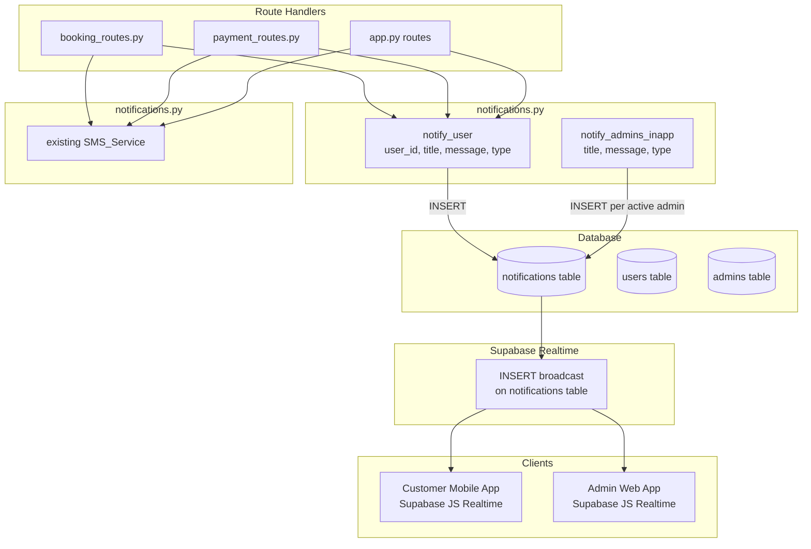

# Design Document: In-App Notifications

## Overview

This design adds a persistent, database-backed in-app notification system for both customers (Capacitor mobile app) and admins (admin web app). Notifications are stored in a `notifications` table in Supabase PostgreSQL and delivered in real-time via Supabase Realtime WebSocket subscriptions. The feature runs alongside the existing Semaphore SMS system without replacing it.

### Key Design Decisions

- **`Notification_Service` as a class in `notifications.py`** — mirrors the existing `SMS_Service` pattern. A module-level singleton `notification_service` is exported for use in route handlers.
- **Notification insertion is fire-and-forget** — wrapped in `try/except` so a DB failure never crashes the route handler or blocks the SMS send.
- **Supabase Realtime on the client** — the mobile app and admin web app subscribe directly to the `notifications` table via the Supabase JS client. No polling needed for live updates.
- **Fallback to REST** — if Realtime is unavailable, `GET /notifications` provides the full history on page load.
- **Existing `NotifStore` is superseded** — the mobile app's local-only store is replaced by server-backed notifications. The `updateNotifBadge()` integration point is preserved.

---

## Architecture



---

## Components and Interfaces

### `Notification_Service` class (`notifications.py`)

```python
class Notification_Service:
    def notify_user(self, user_id: int, title: str, message: str, notif_type: str) -> bool:
        """
        Inserts a notification row for a customer (user_id).
        Returns True on success, False on failure (failure is logged, never raised).
        """

    def notify_admins_inapp(self, title: str, message: str, notif_type: str) -> list[bool]:
        """
        Queries all active admins (is_active=True) and inserts one notification
        row per admin (admin_id). Returns list of booleans.
        """

# Module-level singleton
notification_service = Notification_Service()
```

### Call Sites — Alongside Existing SMS Calls

Every route that calls `sms_service.notify_customer()` or `sms_service.notify_admins()` will also call the corresponding `notification_service` method. The two calls are independent — neither blocks the other.

| Route | File | notification_service call |
|---|---|---|
| `POST /book` | `booking_routes.py` | `notify_user()` + `notify_admins_inapp()` |
| `POST /bookings/<id>/cancel` | `booking_routes.py` | `notify_user()` |
| `PUT /bookings/<id>/approve` | `app.py` | `notify_user()` |
| `PUT /bookings/<id>/reject` | `app.py` | `notify_user()` |
| `PUT /bookings/<id>/cancel` (admin) | `app.py` | `notify_user()` |
| `PUT /bookings/<id>/pickup` | `app.py` | `notify_user()` |
| `PUT /bookings/<id>/complete` | `app.py` | `notify_user()` |
| `PUT /drivers/<id>/approve` | `app.py` | `notify_user()` |
| `PUT /drivers/<id>/reject` | `app.py` | `notify_user()` |
| `POST /admin/verify-action` | `app.py` | `notify_user()` |
| `POST /cancel-booking` (legacy) | `app.py` | `notify_user()` |
| `POST /payment` | `payment_routes.py` | `notify_user()` |
| `POST /bookings/<id>/pay-balance` | `payment_routes.py` | `notify_user()` |
| `POST /admin/bookings/<id>/mark-paid` | `booking_routes.py` | `notify_user()` |
| `POST /legacy-payment` | `app.py` | `notify_user()` + `notify_admins_inapp()` |
| `POST /modify-booking` | `app.py` | `notify_user()` |
| `POST /split-bill/request` | `app.py` | `notify_user()` (partner) |
| `POST /split-bill/pay` | `app.py` | `notify_user()` (initiator) |
| Driver application submission | `app.py` | `notify_admins_inapp()` |

---

## Data Models

### New Table: `notifications`

```sql
CREATE TABLE IF NOT EXISTS notifications (
    id          BIGSERIAL PRIMARY KEY,
    user_id     INTEGER REFERENCES users(id) ON DELETE CASCADE,
    admin_id    INTEGER REFERENCES admins(id) ON DELETE CASCADE,
    title       TEXT NOT NULL,
    message     TEXT NOT NULL,
    type        TEXT NOT NULL,
    is_read     BOOLEAN NOT NULL DEFAULT FALSE,
    created_at  TIMESTAMPTZ NOT NULL DEFAULT NOW(),
    CONSTRAINT chk_one_recipient CHECK (
        (user_id IS NOT NULL AND admin_id IS NULL) OR
        (user_id IS NULL AND admin_id IS NOT NULL)
    )
);

CREATE INDEX IF NOT EXISTS idx_notifications_user_id ON notifications (user_id, created_at DESC);
CREATE INDEX IF NOT EXISTS idx_notifications_admin_id ON notifications (admin_id, created_at DESC);
```

**Column notes:**
- `user_id`: set for customer notifications, NULL for admin notifications
- `admin_id`: set for admin notifications, NULL for customer notifications
- `type`: event type string — e.g. `booking_created`, `payment_confirmed`, `license_approved`
- `is_read`: toggled to `true` when the client calls the read endpoint

### Migration

Add `migrate_notifications()` to `app.py` and call it from `run_migrations()`:

```python
def migrate_notifications():
    """Creates the notifications table and indexes."""
    try:
        cur = get_cursor()
        cur.execute("""
            CREATE TABLE IF NOT EXISTS notifications (
                id         BIGSERIAL PRIMARY KEY,
                user_id    INTEGER REFERENCES users(id) ON DELETE CASCADE,
                admin_id   INTEGER REFERENCES admins(id) ON DELETE CASCADE,
                title      TEXT NOT NULL,
                message    TEXT NOT NULL,
                type       TEXT NOT NULL,
                is_read    BOOLEAN NOT NULL DEFAULT FALSE,
                created_at TIMESTAMPTZ NOT NULL DEFAULT NOW(),
                CONSTRAINT chk_one_recipient CHECK (
                    (user_id IS NOT NULL AND admin_id IS NULL) OR
                    (user_id IS NULL  AND admin_id IS NOT NULL)
                )
            )
        """)
        cur.execute("CREATE INDEX IF NOT EXISTS idx_notifications_user_id  ON notifications (user_id,  created_at DESC)")
        cur.execute("CREATE INDEX IF NOT EXISTS idx_notifications_admin_id ON notifications (admin_id, created_at DESC)")
        commit_db()
        print("DEBUG: Notifications Migration Successful")
    except Exception as e:
        print(f"DEBUG: Notifications Migration Failed: {e}")
    finally:
        if 'cur' in locals(): cur.close()
```

---

## API Endpoints

### Customer Endpoints

**`GET /notifications?user_id=<int>`**
- Returns all notifications for the user ordered by `created_at DESC`
- Response `200`: `[{ "id", "title", "message", "type", "is_read", "created_at" }, ...]`
- Response `400`: missing or non-integer `user_id`

**`POST /notifications/<id>/read`**
- Request body: `{ "user_id": int }`
- Sets `is_read = true` for the notification
- Response `200`: `{ "id", "title", "message", "type", "is_read", "created_at" }`
- Response `403`: notification's `user_id` does not match request body
- Response `404`: notification not found

**`POST /notifications/read-all`**
- Request body: `{ "user_id": int }`
- Sets `is_read = true` for all notifications belonging to the user
- Response `200`: `{ "updated": <count> }`
- Response `400`: missing or non-integer `user_id`

### Admin Endpoints

**`GET /admin/notifications?admin_id=<int>`**
- Returns all notifications for the admin ordered by `created_at DESC`
- Response `200`: `[{ "id", "title", "message", "type", "is_read", "created_at" }, ...]`
- Response `400`: missing or non-integer `admin_id`

**`POST /admin/notifications/<id>/read`**
- Request body: `{ "admin_id": int }`
- Sets `is_read = true` for the notification
- Response `200`: `{ "id", "title", "message", "type", "is_read", "created_at" }`
- Response `403`: notification's `admin_id` does not match request body
- Response `404`: notification not found

**`POST /admin/notifications/read-all`**
- Request body: `{ "admin_id": int }`
- Sets `is_read = true` for all notifications belonging to the admin
- Response `200`: `{ "updated": <count> }`
- Response `400`: missing or non-integer `admin_id`

---

## Customer Mobile App Changes (`www/js/app.js` + `www/index.html`)

### Supabase Client Initialisation

Add to `index.html` before `app.js`:
```html
<script src="https://cdn.jsdelivr.net/npm/@supabase/supabase-js@2"></script>
```

Add to `app.js`:
```js
var SUPABASE_URL = 'https://fydfsgjrlowrrtlmefwq.supabase.co';
var SUPABASE_ANON_KEY = 'eyJhbGciOiJIUzI1NiIsInR5cCI6IkpXVCJ9...';
var supabaseClient = supabase.createClient(SUPABASE_URL, SUPABASE_ANON_KEY);
var notifChannel = null;
var notifList = [];  // in-memory cache
```

### `loadNotifications(userId)` — replaces `NotifStore`

```js
function loadNotifications(userId) {
    return apiCall('/notifications?user_id=' + userId)
        .then(function(data) {
            notifList = data;
            updateNotifBadge();
            return data;
        })
        .catch(function() { return []; });
}
```

### `updateNotifBadge()` — updated to use server data

```js
function updateNotifBadge() {
    var unread = notifList.filter(function(n) { return !n.is_read; }).length;
    var badge = document.getElementById('notifBadge');
    if (!badge) return;
    if (unread > 0) {
        badge.textContent = unread > 99 ? '99+' : unread;
        badge.classList.remove('hidden');
    } else {
        badge.classList.add('hidden');
    }
}
```

### Supabase Realtime Subscription

Called after login:
```js
function subscribeToNotifications(userId) {
    if (notifChannel) supabaseClient.removeChannel(notifChannel);
    notifChannel = supabaseClient
        .channel('user-notifications-' + userId)
        .on('postgres_changes', {
            event: 'INSERT',
            schema: 'public',
            table: 'notifications',
            filter: 'user_id=eq.' + userId
        }, function(payload) {
            notifList.unshift(payload.new);
            updateNotifBadge();
        })
        .subscribe();
}

function unsubscribeFromNotifications() {
    if (notifChannel) {
        supabaseClient.removeChannel(notifChannel);
        notifChannel = null;
    }
}
```

### Notifications Page Render

```js
function openNotificationsPage() {
    showPage('page-notifications');
    var container = document.getElementById('notificationsContent');
    container.innerHTML = '<div class="empty-state"><div class="spinner"></div></div>';

    var userId = currentUser.id;
    // Mark all read
    apiCall('/notifications/read-all', { method: 'POST', body: JSON.stringify({ user_id: userId }) })
        .then(function() {
            notifList.forEach(function(n) { n.is_read = true; });
            updateNotifBadge();
        }).catch(function() {});

    apiCall('/notifications?user_id=' + userId)
        .then(function(data) {
            notifList = data;
            updateNotifBadge();
            if (!data.length) {
                container.innerHTML = '<div class="empty-state"><i class="fas fa-bell-slash"></i><p>No notifications yet</p></div>';
                return;
            }
            container.innerHTML = data.map(function(n) {
                return '<div class="notif-item' + (n.is_read ? '' : ' unread') + '">' +
                    '<p><strong>' + escapeHtml(n.title) + '</strong></p>' +
                    '<p>' + escapeHtml(n.message) + '</p>' +
                    '<small>' + formatDate(n.created_at) + '</small>' +
                    '</div>';
            }).join('');
        })
        .catch(function() {
            container.innerHTML = '<div class="empty-state"><i class="fas fa-exclamation-circle"></i><p>Failed to load notifications</p></div>';
        });
}
```

---

## Admin Web App Changes (`admin_app/booking-management.js` or shared JS)

### Notification Bell UI (add to admin header HTML)

```html
<div class="notif-btn-wrap" style="position:relative;display:inline-block;">
  <button onclick="toggleAdminNotifPanel()" style="background:none;border:none;cursor:pointer;font-size:1.3rem;color:#333;">
    <i class="fas fa-bell"></i>
  </button>
  <span id="adminNotifBadge" class="notif-badge hidden">0</span>
</div>
<div id="adminNotifPanel" class="hidden" style="position:absolute;right:0;top:50px;width:340px;max-height:480px;overflow-y:auto;background:#fff;border-radius:12px;box-shadow:0 8px 32px rgba(0,0,0,0.15);z-index:1000;padding:16px;">
  <h4 style="margin-bottom:12px;font-weight:700;">Notifications</h4>
  <div id="adminNotifList"></div>
</div>
```

### Admin Notification JS

```js
var adminNotifList = [];
var adminNotifChannel = null;

function loadAdminNotifications(adminId) {
    fetch(API_BASE + '/admin/notifications?admin_id=' + adminId)
        .then(function(r) { return r.json(); })
        .then(function(data) {
            adminNotifList = data;
            updateAdminNotifBadge();
        }).catch(function() {});
}

function updateAdminNotifBadge() {
    var unread = adminNotifList.filter(function(n) { return !n.is_read; }).length;
    var badge = document.getElementById('adminNotifBadge');
    if (!badge) return;
    if (unread > 0) {
        badge.textContent = unread > 99 ? '99+' : unread;
        badge.classList.remove('hidden');
    } else {
        badge.classList.add('hidden');
    }
}

function subscribeAdminNotifications(adminId) {
    if (adminNotifChannel) supabaseClient.removeChannel(adminNotifChannel);
    adminNotifChannel = supabaseClient
        .channel('admin-notifications-' + adminId)
        .on('postgres_changes', {
            event: 'INSERT',
            schema: 'public',
            table: 'notifications',
            filter: 'admin_id=eq.' + adminId
        }, function(payload) {
            adminNotifList.unshift(payload.new);
            updateAdminNotifBadge();
        })
        .subscribe();
}

function toggleAdminNotifPanel() {
    var panel = document.getElementById('adminNotifPanel');
    var list = document.getElementById('adminNotifList');
    panel.classList.toggle('hidden');
    if (!panel.classList.contains('hidden')) {
        // Mark all read
        var adminId = getCurrentAdminId();
        fetch(API_BASE + '/admin/notifications/read-all', {
            method: 'POST',
            headers: { 'Content-Type': 'application/json' },
            body: JSON.stringify({ admin_id: adminId })
        }).then(function() {
            adminNotifList.forEach(function(n) { n.is_read = true; });
            updateAdminNotifBadge();
        }).catch(function() {});

        if (!adminNotifList.length) {
            list.innerHTML = '<p style="color:#888;text-align:center;padding:20px;">No notifications yet</p>';
        } else {
            list.innerHTML = adminNotifList.map(function(n) {
                return '<div style="padding:10px 0;border-bottom:1px solid #f0f0f0;">' +
                    '<strong style="font-size:0.9rem;">' + n.title + '</strong>' +
                    '<p style="font-size:0.8rem;color:#555;margin-top:2px;">' + n.message + '</p>' +
                    '<small style="color:#aaa;">' + new Date(n.created_at).toLocaleString() + '</small>' +
                    '</div>';
            }).join('');
        }
    }
}
```

---

## Notification Type Reference

| Type | Recipient | Title |
|---|---|---|
| `booking_created` | customer | Booking Received |
| `booking_approved` | customer | Booking Approved |
| `booking_rejected` | customer | Booking Rejected |
| `booking_cancelled` | customer | Booking Cancelled |
| `booking_cancelled_by_admin` | customer | Booking Cancelled |
| `booking_picked_up` | customer | Vehicle Picked Up |
| `booking_completed` | customer | Booking Completed |
| `booking_modified` | customer | Booking Updated |
| `payment_confirmed` | customer | Payment Confirmed |
| `payment_downpayment` | customer | Downpayment Received |
| `payment_balance` | customer | Balance Payment Received |
| `payment_cash` | customer | Payment Confirmed |
| `split_request` | customer (partner) | Split Payment Request |
| `split_paid` | customer (initiator) | Split Payment Received |
| `license_approved` | customer | License Approved |
| `license_rejected` | customer | License Rejected |
| `driver_approved` | customer | Driver Application Approved |
| `driver_rejected` | customer | Driver Application Rejected |
| `admin_new_booking` | admin | New Booking |
| `admin_driver_application` | admin | New Driver Application |
| `admin_payment_proof` | admin | Payment Proof Uploaded |

---

## Correctness Properties

### Property 1: notify_user always inserts exactly one row

*For any* valid `user_id`, `title`, `message`, and `type`, calling `notify_user()` SHALL result in exactly one new row in the `notifications` table with `user_id` set and `admin_id` NULL.

### Property 2: notify_admins_inapp inserts one row per active admin

*For any* list of admins with mixed `is_active` values, calling `notify_admins_inapp()` SHALL insert exactly one notification row per active admin and zero rows for inactive admins.

### Property 3: GET /notifications returns only the requesting user's notifications

*For any* `user_id`, `GET /notifications?user_id=X` SHALL return only rows where `user_id = X` and SHALL NOT return rows belonging to other users or to admins.

### Property 4: read-all sets is_read=true for all user notifications

*For any* user with N unread notifications, calling `POST /notifications/read-all` SHALL result in all N notifications having `is_read = true` and the endpoint returning `{ "updated": N }`.

### Property 5: Notification ordering invariant

*For any* set of N notifications for a user, `GET /notifications` SHALL return them ordered by `created_at DESC` — i.e., the newest notification is always first.

### Property 6: notify_user failure does not raise

*For any* DB failure during `notify_user()`, the function SHALL catch the exception, log it to stderr, and return `False` without raising — ensuring the calling route handler is not affected.

---

## Error Handling

- All `Notification_Service` methods are wrapped in `try/except` — failures are logged to stderr and return `False`/`[]`
- Route handlers do not check the return value of `notification_service` calls — they are fire-and-forget
- If `GET /notifications` fails on the client, the app shows an error state but does not crash
- If Supabase Realtime is unavailable, the app falls back to the REST endpoint on page load
