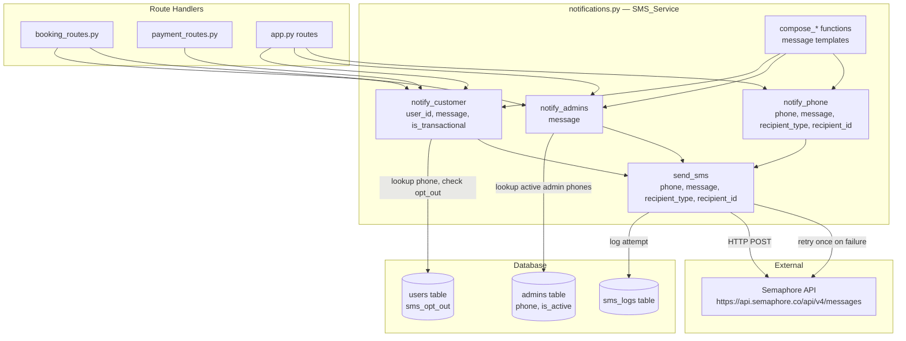

# Design Document: SMS Notification

## Overview

This design refactors the existing `notifications.py` into a proper `SMS_Service` class that handles all SMS delivery for the AutorideSystem. The current implementation is a single `send_notification()` function that sends both email and SMS with no retry logic, no delivery logging, and no opt-out support. The refactored service adds retry-on-failure, a `sms_logs` database table, SMS opt-out preference management, admin SMS alerts, and richer message templates that include vehicle details, dates, amounts, and reference numbers.

Email delivery is out of scope — the existing email logic in `send_notification()` will be preserved as-is and called alongside the new SMS_Service.

### Key Design Decisions

- **`SMS_Service` as a module-level class** rather than a standalone function, so state (config, DB cursor factory) is injected cleanly and the service is easily testable with mocks.
- **Message composition is separated from delivery** — each event type has a dedicated `compose_*` function that returns a plain string. This makes message templates independently testable without touching the Semaphore API.
- **`notify_customer()` and `notify_admins()` are the public API** for route handlers. They handle DB lookups, opt-out checks, and fan-out to multiple admin recipients. Route handlers never call `send_sms()` directly.
- **`admins` table needs `phone` and `is_active` columns** added via migration, since the current schema has neither.
- **`users` table needs `sms_opt_out` column** added via migration.
- **New `sms_logs` table** records every delivery attempt.

---

## Architecture



### Flow: Customer Notification

1. Route handler calls `notify_customer(user_id, message, is_transactional=True)`
2. `notify_customer` queries `users` for `phone_number` and `sms_opt_out`
3. If `sms_opt_out=True` and `is_transactional=False`, skip and return
4. Calls `send_sms(phone, message, recipient_type='customer', recipient_id=user_id)`
5. `send_sms` posts to Semaphore API; on failure, waits 2s and retries once
6. Logs outcome to `sms_logs`

### Flow: Admin Alert

1. Route handler calls `notify_admins(message)`
2. `notify_admins` queries `admins` for all rows where `is_active=True` and `phone IS NOT NULL`
3. For each admin, calls `send_sms(phone, message, recipient_type='admin', recipient_id=admin_id)`
4. Each send is logged independently to `sms_logs`

---

## Components and Interfaces

### `SMS_Service` class (`notifications.py`)

```python
class SMS_Service:
    def send_sms(self, phone: str, message: str, recipient_type: str, recipient_id: int | None) -> bool:
        """
        Core delivery function. Prefixes message with 'AUTORIDE:', truncates to 320 chars,
        posts to Semaphore API. Retries once on failure after 2s. Logs every attempt.
        Returns True on success, False on failure.
        """

    def notify_customer(self, user_id: int, message: str, is_transactional: bool = True) -> bool:
        """
        Looks up user phone and sms_opt_out from DB.
        Skips send if sms_opt_out=True and is_transactional=False.
        Calls send_sms() with recipient_type='customer'.
        """

    def notify_admins(self, message: str) -> list[bool]:
        """
        Queries all active admins with phone numbers.
        Calls send_sms() for each. Returns list of results.
        """

    def notify_phone(self, phone: str, message: str, recipient_type: str, recipient_id: int | None) -> bool:
        """
        Sends to a known phone number directly (used for OTP where user_id lookup is not needed).
        Delegates to send_sms().
        """
```

### Message Composition Functions (module-level, pure functions)

These are pure functions — they take data and return a formatted string. They do not call the DB or Semaphore.

```python
# Booking lifecycle
def compose_booking_created_sms(booking_id, brand, model, start_date, end_date, total_price) -> str
def compose_booking_approved_sms(booking_id, brand, model, start_date) -> str
def compose_booking_rejected_sms(booking_id) -> str
def compose_customer_cancel_sms(booking_id, reason) -> str
def compose_admin_cancel_sms(booking_id, reason) -> str
def compose_pickup_sms(booking_id, brand, model, end_date) -> str
def compose_completed_sms(booking_id) -> str
def compose_modify_booking_sms(booking_id, new_start, new_end, new_total) -> str

# Payment
def compose_full_payment_sms(booking_id, amount, method, reference_number) -> str
def compose_downpayment_sms(booking_id, amount_paid, balance_amount, reference_number) -> str
def compose_balance_payment_sms(booking_id, amount, reference_number) -> str
def compose_cash_paid_sms(booking_id, total_amount) -> str

# Split payment
def compose_split_request_sms(booking_id, initiator_name, amount) -> str
def compose_split_paid_sms(booking_id, amount) -> str

# License verification
def compose_license_approved_sms() -> str
def compose_license_rejected_sms() -> str

# Driver application
def compose_driver_approved_sms(driver_name) -> str
def compose_driver_rejected_sms(reason) -> str

# Admin alerts
def compose_admin_new_booking_sms(booking_id, customer_name, brand, model, start_date, end_date) -> str
def compose_admin_driver_application_sms(applicant_name) -> str
def compose_admin_payment_proof_sms(booking_id, customer_name, amount) -> str

# OTP
def compose_otp_sms(otp_code) -> str

# Utility
def truncate_message(message: str, max_len: int = 320) -> str
```

### Backward-Compatible `send_notification()` Wrapper

The existing `send_notification(user_id, subject, message)` function is preserved for email delivery. SMS calls are migrated to use `SMS_Service` directly. The wrapper will remain for email-only use.

### New API Endpoints

**`POST /user/sms-preference`**
- Request body: `{ "user_id": int, "sms_opt_out": bool }`
- Updates `users.sms_opt_out` for the given user
- Response `200`: `{ "user_id": int, "sms_opt_out": bool }`
- Response `400`: missing parameters
- Response `404`: user not found

**`GET /admin/sms-logs`**
- Query params: `page` (default 1), `per_page` (default 50), `recipient_type` (optional: `customer`, `driver`, `admin`)
- Returns paginated `sms_logs` records ordered by `created_at DESC`
- Response `200`:
  ```json
  {
    "logs": [...],
    "page": 1,
    "per_page": 50,
    "total": 123
  }
  ```

---

## Data Models

### New Table: `sms_logs`

```sql
CREATE TABLE sms_logs (
    id                      SERIAL PRIMARY KEY,
    recipient_phone         TEXT NOT NULL,
    recipient_type          TEXT NOT NULL CHECK (recipient_type IN ('customer', 'driver', 'admin')),
    recipient_id            INTEGER,
    message_body            TEXT NOT NULL,
    status                  TEXT NOT NULL CHECK (status IN ('sent', 'failed', 'retried')),
    semaphore_response_code INTEGER,
    error_message           TEXT,
    created_at              TIMESTAMPTZ NOT NULL DEFAULT NOW()
);

CREATE INDEX idx_sms_logs_created_at ON sms_logs (created_at DESC);
CREATE INDEX idx_sms_logs_recipient_type ON sms_logs (recipient_type);
```

**Column notes:**
- `recipient_type`: `'customer'` for end-users, `'driver'` for driver applicants, `'admin'` for admin alerts
- `recipient_id`: the `users.id` or `admins.id`; nullable for OTP sends where only phone is known
- `status`: `'sent'` = delivered, `'failed'` = all attempts exhausted, `'retried'` = first attempt failed, retry in progress
- `semaphore_response_code`: HTTP status code from Semaphore API response
- `error_message`: exception message or Semaphore error body on failure

### Migration: `users` table

```sql
ALTER TABLE users ADD COLUMN IF NOT EXISTS sms_opt_out BOOLEAN NOT NULL DEFAULT FALSE;
```

### Migration: `admins` table

```sql
ALTER TABLE admins ADD COLUMN IF NOT EXISTS phone VARCHAR(20);
ALTER TABLE admins ADD COLUMN IF NOT EXISTS is_active BOOLEAN NOT NULL DEFAULT TRUE;
```

The `is_active` column defaults to `TRUE` so existing admin records are treated as active. Admin phone numbers must be populated manually or via the admin management UI.

### Existing Tables Referenced

**`bookings`** — queried for `user_id`, `vehicle_id`, `start_date`, `end_date`, `total_price`, `brand`/`model` (via JOIN to `vehicles`), `payment_type`, `amount_paid`, `balance_amount`

**`split_payments`** — queried for `booking_id`, `partner_email`, `amount`, `status`; partner user looked up via `users.email`

**`users`** — queried for `phone_number`, `sms_opt_out`, `full_name`

**`admins`** — queried for `phone`, `is_active`

---

## SMS Message Templates

All messages are prefixed with `AUTORIDE:` by `send_sms()` automatically. The compose functions return the body without the prefix. Messages exceeding 320 characters are truncated to 317 + `...`.

### Booking Lifecycle

| Event | Template |
|---|---|
| Booking created | `Your booking #[ID] for [Brand] [Model] from [start] to [end] has been received. Total: PHP [price]. We'll review it shortly.` |
| Booking approved | `Good news! Booking #[ID] for [Brand] [Model] starting [start] has been approved. Please proceed with pickup as scheduled.` |
| Booking rejected | `Booking #[ID] has been rejected. Please contact our support team for assistance.` |
| Customer cancelled | `Your booking #[ID] has been cancelled. Reason: [reason].` |
| Admin cancelled | `Your booking #[ID] has been cancelled by our team. Reason: [reason]. A refund will be initiated if applicable.` |
| Picked up | `Drive safely! Booking #[ID] for [Brand] [Model] is now active. Return by [end_date].` |
| Completed | `Thank you for choosing Autoride! Booking #[ID] is now completed. We hope to see you again.` |
| Dates modified | `Your booking #[ID] dates have been updated: [new_start] to [new_end]. New total: PHP [new_total].` |

### Payment

| Event | Template |
|---|---|
| Full payment | `Payment confirmed for booking #[ID]. Amount: PHP [amount] via [method]. Ref: [ref]. Your booking is confirmed.` |
| Downpayment | `Downpayment of PHP [amount] received for booking #[ID]. Ref: [ref]. Remaining balance: PHP [balance].` |
| Balance payment | `Balance payment of PHP [amount] received for booking #[ID]. Ref: [ref]. Your booking is now fully paid.` |
| Admin cash mark-paid | `Your booking #[ID] has been marked as fully paid. Total amount: PHP [total]. Thank you!` |

### Split Payment

| Event | Template |
|---|---|
| Split request (to partner) | `[initiator_name] has requested a split payment for booking #[ID]. Your share: PHP [amount]. Please pay via the Autoride app.` |
| Split paid (to initiator) | `Your split payment partner has paid PHP [amount] for booking #[ID].` |

### License Verification

| Event | Template |
|---|---|
| License approved | `Your driver's license has been verified! You can now book vehicles on Autoride.` |
| License rejected | `Your driver's license was not approved. Please re-upload a valid document through the app.` |

### Driver Application

| Event | Template |
|---|---|
| Application approved | `Congratulations, [name]! Your driver application has been approved. You can now start accepting bookings.` |
| Application rejected | `Your driver application was not approved. Reason: [reason]. You may re-apply once the issues are resolved.` |

### Admin Alerts

| Event | Template |
|---|---|
| New booking | `New booking #[ID] from [customer_name] for [Brand] [Model], [start] to [end]. Review in admin panel.` |
| New driver application | `New driver application from [applicant_name]. Please review in the admin panel.` |
| Legacy payment proof | `Payment proof uploaded for booking #[ID] by [customer_name]. Amount: PHP [amount]. Review in admin panel.` |

### OTP

| Event | Template |
|---|---|
| OTP | `Your Autoride login code is [otp]. It expires in 10 minutes. Do not share this code.` |

---

## Integration Points

### Routes Requiring Updated Message Templates (existing `send_notification` calls)

These routes already call `send_notification()`. They need to be updated to use `SMS_Service.notify_customer()` with richer templates that include vehicle/date/amount data.

| Route | File | Change |
|---|---|---|
| `POST /book` | `booking_routes.py` | Add vehicle brand/model, dates, total_price to message; also call `notify_admins()` for Req 6.1 |
| `POST /bookings/<id>/cancel` | `booking_routes.py` | Add cancellation reason to message |
| `PUT /bookings/<id>/approve` | `app.py` | Add vehicle brand/model, start_date to message |
| `PUT /bookings/<id>/reject` | `app.py` | Message already adequate; migrate to SMS_Service |
| `PUT /bookings/<id>/cancel` | `app.py` | Add cancellation reason to message |
| `PUT /bookings/<id>/pickup` | `app.py` | Add vehicle brand/model, end_date to message |
| `PUT /bookings/<id>/complete` | `app.py` | Message adequate; migrate to SMS_Service |
| `PUT /drivers/<id>/approve` | `app.py` | Add driver name to message |
| `PUT /drivers/<id>/reject` | `app.py` | Message already includes reason; migrate to SMS_Service |
| `POST /admin/verify-action` | `app.py` | Currently sends no SMS — add license approved/rejected SMS |
| `POST /cancel-booking` (legacy) | `app.py` | Add cancellation reason; migrate to SMS_Service |

### Routes Requiring New SMS Calls (currently no SMS)

| Route | File | SMS to Send |
|---|---|---|
| `POST /payment` | `payment_routes.py` | `notify_customer()` with full payment or downpayment template (Req 2.1, 2.2) |
| `POST /bookings/<id>/pay-balance` | `payment_routes.py` | `notify_customer()` with balance payment template (Req 2.3) |
| `POST /admin/bookings/<id>/mark-paid` | `booking_routes.py` | `notify_customer()` with cash mark-paid template (Req 2.4) |
| `POST /legacy-payment` | `app.py` | `notify_customer()` with payment template + `notify_admins()` for payment proof alert (Req 2.1/2.2, 6.3) |
| `POST /modify-booking` | `app.py` | `notify_customer()` with dates-modified template (Req 1.8) |
| `POST /split-bill/request` | `app.py` | `notify_phone()` or `notify_customer()` to partner with split request template (Req 3.1) |
| `POST /split-bill/pay` | `app.py` | `notify_customer()` to booking initiator with split paid template (Req 3.2) |
| `POST /book` | `booking_routes.py` | `notify_admins()` with new booking alert (Req 6.1) — in addition to existing customer SMS |
| Driver application submission route | `app.py` | `notify_admins()` with new driver application alert (Req 6.2) |

### New Endpoints to Add

| Endpoint | File | Description |
|---|---|---|
| `POST /user/sms-preference` | `app.py` | Update `users.sms_opt_out` |
| `GET /admin/sms-logs` | `app.py` | Paginated SMS log viewer |

---

## Correctness Properties

*A property is a characteristic or behavior that should hold true across all valid executions of a system — essentially, a formal statement about what the system should do. Properties serve as the bridge between human-readable specifications and machine-verifiable correctness guarantees.*

### Property 1: Message truncation preserves length invariant

*For any* string of any length, after applying `truncate_message()`, the result SHALL have length ? 320. If the input length exceeds 320, the result SHALL be exactly 320 characters and end with `...`. If the input length is ? 320, the result SHALL equal the input unchanged.

**Validates: Requirements 11.4**

---

### Property 2: Booking lifecycle messages contain required fields

*For any* combination of booking ID, vehicle brand, vehicle model, start date, end date, and total price, the output of `compose_booking_created_sms()` SHALL contain the booking ID, brand, model, start date, end date, and total price as substrings.

*For any* combination of booking ID, brand, model, and start date, the output of `compose_booking_approved_sms()` SHALL contain the booking ID, brand, model, and start date.

*For any* combination of booking ID, brand, model, and end date, the output of `compose_pickup_sms()` SHALL contain the booking ID, brand, model, and end date.

*For any* combination of booking ID, new start date, new end date, and new total price, the output of `compose_modify_booking_sms()` SHALL contain all four values.

**Validates: Requirements 1.1, 1.2, 1.6, 1.8, 11.2**

---

### Property 3: Cancellation messages preserve the cancellation reason

*For any* booking ID and any non-empty cancellation reason string, the output of `compose_customer_cancel_sms()` SHALL contain both the booking ID and the reason as substrings.

*For any* booking ID and any non-empty cancellation reason string, the output of `compose_admin_cancel_sms()` SHALL contain the booking ID, the reason, and a refund notice.

**Validates: Requirements 1.4, 1.5**

---

### Property 4: Payment messages contain required financial fields

*For any* combination of booking ID, amount, payment method, and reference number, the output of `compose_full_payment_sms()` SHALL contain all four values as substrings.

*For any* combination of booking ID, downpayment amount, balance amount, and reference number, the output of `compose_downpayment_sms()` SHALL contain all four values.

*For any* combination of booking ID, balance amount, and reference number, the output of `compose_balance_payment_sms()` SHALL contain all three values.

*For any* combination of booking ID and total amount, the output of `compose_cash_paid_sms()` SHALL contain both values.

**Validates: Requirements 2.1, 2.2, 2.3, 2.4, 11.3**

---

### Property 5: Split payment messages contain required fields

*For any* combination of booking ID, initiator name, and amount, the output of `compose_split_request_sms()` SHALL contain all three values as substrings.

*For any* combination of booking ID and amount, the output of `compose_split_paid_sms()` SHALL contain both values.

**Validates: Requirements 3.1, 3.2**

---

### Property 6: Driver application messages preserve variable fields

*For any* driver name string, the output of `compose_driver_approved_sms()` SHALL contain the driver name as a substring.

*For any* rejection reason string, the output of `compose_driver_rejected_sms()` SHALL contain the reason as a substring.

**Validates: Requirements 5.1, 5.2**

---

### Property 7: Admin alert messages contain required fields

*For any* combination of booking ID, customer name, brand, model, start date, and end date, the output of `compose_admin_new_booking_sms()` SHALL contain all six values as substrings.

*For any* applicant name, the output of `compose_admin_driver_application_sms()` SHALL contain the name.

*For any* combination of booking ID, customer name, and amount, the output of `compose_admin_payment_proof_sms()` SHALL contain all three values.

**Validates: Requirements 6.1, 6.2, 6.3**

---

### Property 8: OTP messages contain the OTP code

*For any* 6-digit OTP string, the output of `compose_otp_sms()` SHALL contain the OTP code as a substring and SHALL include an expiry notice.

**Validates: Requirements 7.1**

---

### Property 9: Opt-out blocks promotional SMS but not transactional SMS

*For any* user with `sms_opt_out=True`, calling `notify_customer(user_id, message, is_transactional=False)` SHALL result in zero calls to `send_sms()`.

*For any* user with `sms_opt_out=True`, calling `notify_customer(user_id, message, is_transactional=True)` SHALL result in exactly one call to `send_sms()`.

**Validates: Requirements 8.2, 8.3**

---

### Property 10: SMS preference endpoint round-trip

*For any* boolean value `v`, calling `POST /user/sms-preference` with `sms_opt_out=v` for a valid user SHALL return a `200` response with `sms_opt_out` equal to `v` in the response body, and the `users` table SHALL reflect `sms_opt_out=v` for that user.

**Validates: Requirements 8.4, 8.5**

---

### Property 11: Every SMS send produces exactly one log entry

*For any* call to `send_sms()`, the `sms_logs` table row count SHALL increase by exactly 1, regardless of whether the send succeeded or failed.

**Validates: Requirements 10.2**

---

### Property 12: SMS log pagination returns correct ordered slices

*For any* set of N log entries and any valid `page`/`per_page` combination, `GET /admin/sms-logs` SHALL return records ordered by `created_at DESC`, and the slice returned SHALL correspond exactly to the correct page offset.

**Validates: Requirements 10.5**

---

### Property 13: SMS log filtering returns only matching recipient types

*For any* `recipient_type` value in `{customer, driver, admin}`, calling `GET /admin/sms-logs?recipient_type=X` on a log table containing mixed recipient types SHALL return only records where `recipient_type = X`.

**Validates: Requirements 10.6**

---

### Property 14: notify_admins only sends to active admins

*For any* list of admins with a mix of `is_active=True` and `is_active=False`, calling `notify_admins()` SHALL invoke `send_sms()` exactly once per active admin with a non-null phone number, and SHALL NOT invoke `send_sms()` for any inactive admin or admin without a phone number.

**Validates: Requirements 6.4**

---

## Error Handling

### Semaphore API Failures

`send_sms()` catches all exceptions from the `requests.post()` call. On a non-2xx response or network exception:
1. Log a `'retried'` entry to `sms_logs`
2. `time.sleep(2)`
3. Retry the request once
4. If retry succeeds, log `'sent'`
5. If retry fails, log `'failed'` with the error message and response code

SMS failures are **non-fatal** — they are logged but do not cause the route handler to return an error response. The booking/payment operation has already committed to the DB before the SMS is sent.

### Missing Phone Numbers

If a user has no `phone_number` in the DB, `notify_customer()` logs a warning and returns `False` without calling `send_sms()`. No log entry is written to `sms_logs` (there is no phone to record).

If an admin has no `phone` value, `notify_admins()` skips that admin silently.

### DB Lookup Failures

If the DB query in `notify_customer()` or `notify_admins()` raises an exception, it is caught, logged to stderr, and the function returns `False`/`[]`. The route handler is not affected.

### OTP Failures

OTP delivery failure is the one case where the caller needs to know. `notify_phone()` returns `False` on failure, and the OTP route handler should return an error response to the client (Req 7.3).

---

## Testing Strategy

### Unit Tests (example-based)

- `compose_booking_rejected_sms(booking_id)` returns a string containing the booking ID and support contact text
- `compose_completed_sms(booking_id)` returns a string containing the booking ID and thank-you text
- `compose_license_approved_sms()` contains "verified" and "book vehicles"
- `compose_license_rejected_sms()` contains "not approved" and "re-upload"
- `send_sms()` with mocked Semaphore returning 200 ? logs `status='sent'`, returns `True`
- `send_sms()` with mocked Semaphore always failing ? logs `status='failed'`, API called exactly twice
- `send_sms()` with mocked Semaphore failing then succeeding ? logs `status='retried'` then `status='sent'`, API called exactly twice
- `send_sms()` with mocked Semaphore succeeding ? API called exactly once (no retry)
- `POST /user/sms-preference` with valid data ? 200 response, DB updated
- `POST /user/sms-preference` with missing fields ? 400 response
- `GET /admin/sms-logs` with no filters ? returns all records ordered by `created_at DESC`

### Property-Based Tests

Use [Hypothesis](https://hypothesis.readthedocs.io/) (Python PBT library). Each property test runs a minimum of 100 iterations.

Tag format: `# Feature: sms-notification, Property N: <property_text>`

- **Property 1**: `truncate_message()` — generate strings of random length, verify length invariant and `...` suffix
- **Property 2**: Booking lifecycle compose functions — generate random booking data, verify required fields present
- **Property 3**: Cancellation compose functions — generate random reasons, verify reason appears in output
- **Property 4**: Payment compose functions — generate random amounts/refs/methods, verify all fields present
- **Property 5**: Split payment compose functions — generate random names/amounts, verify fields present
- **Property 6**: Driver application compose functions — generate random names/reasons, verify fields present
- **Property 7**: Admin alert compose functions — generate random booking/customer data, verify fields present
- **Property 8**: OTP compose function — generate random 6-digit codes, verify code and expiry present
- **Property 9**: Opt-out logic — generate users with `sms_opt_out=True`, verify `send_sms()` call count
- **Property 10**: SMS preference round-trip — generate random booleans, POST and verify response matches
- **Property 11**: Log entry count — generate random sends, verify `sms_logs` count increments by 1
- **Property 12**: Pagination ordering — generate N log entries, verify page slices are ordered and correct
- **Property 13**: Log filtering — generate mixed-type logs, verify filter returns only matching type
- **Property 14**: Admin fan-out — generate mixed active/inactive admin lists, verify only active admins receive SMS

### Integration Tests

- End-to-end: `POST /book` ? verify `sms_logs` contains one customer entry and one-per-active-admin entry
- End-to-end: `POST /payment` ? verify `sms_logs` contains a customer payment confirmation entry
- Semaphore API connectivity smoke test (skipped in CI, run manually)
